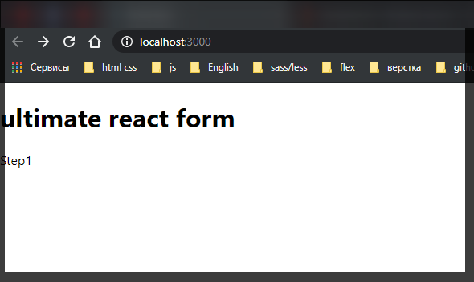
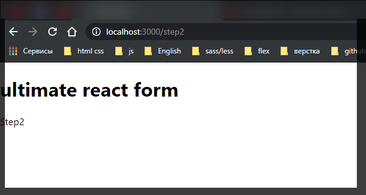

# form все самые сложные моменты работы с формами.

```shell
npx create-react-app ultimate-form-challenge
```

Устанавливаю зависимости.

```shell
npm i react-router-dom
```

[https://www.npmjs.com/package/react-router-dom](https://www.npmjs.com/package/react-router-dom)

Это нужно для того что бы переключатся между разными шагами формы.

<hr>

**yup** - потребуется для валидации формы

```shell
npm i yup@0.26.10
```

[https://www.npmjs.com/package/yup/v/0.26.10](https://www.npmjs.com/package/yup/v/0.26.10)

<hr>

**material-ui** - для стилизации

```shell
npm i material-ui
```

[https://www.npmjs.com/package/material-ui](https://www.npmjs.com/package/material-ui)

```shell
@material-ui/core
```

[https://www.npmjs.com/package/@material-ui/core](https://www.npmjs.com/package/@material-ui/core)

```shell
npm i @material-ui/icons
```

[https://www.npmjs.com/package/@material-ui/icons](https://www.npmjs.com/package/@material-ui/icons)

<hr>

**libphonenumber-js**

```shell
npm i libphonenumber-js
```

[https://www.npmjs.com/package/libphonenumber-js](https://www.npmjs.com/package/libphonenumber-js)

<hr>

**react-dropzone**

```shell
npm i react-dropzone
```

[https://www.npmjs.com/package/react-dropzone](https://www.npmjs.com/package/react-dropzone)

<hr>

**react-hook-form**

```shell
npm i react-hook-form
```

[https://www.npmjs.com/package/react-hook-form](https://www.npmjs.com/package/react-hook-form)

<hr>

**sweetalert2**

```shell
npm i sweetalert2
```

[https://www.npmjs.com/package/sweetalert2](https://www.npmjs.com/package/sweetalert2)

<hr>

**react-confetti**

```shell
npm i react-confetti
```

[https://www.npmjs.com/package/react-confetti](https://www.npmjs.com/package/react-confetti)

<hr>

После установки перехожу в **App.js** и удаляю все лишнее.

```jsx
import React from 'react';

function App() {
  return (

  );
}

export default App;

```

В первую очередь нам нужно сделать переключение между шагами. Оборачиваю все в фрагмент.

```jsx
import React from 'react';

function App() {
  return (
    <>
      <Header />
    </>
  );
}

export default App;
```

Далее мне нужно импортировать **Router**

```jsx
import React from 'react';
import { BrowserRouter as Router } from 'react-router-dom';

function App() {
  return (
    <>
      <Header />
      <Router></Router>
    </>
  );
}

export default App;
```

Так же внутри **Router** у нас будет компонент **Switch**. Он нужен для того что бы в каждый момент времени, в зависимости от той страници где мы находимся рендерился только один компонент. Или иначе они будут рендерится все.

И дальше у нас будут **Route**. Первый **Route** указываю как корневой. Обязательный параметр **exect** т.е. только если только **url** в котором мы находимся корневой и ничего после слэша не идет, тогда мы рендерим компонент который называется **Step1**

```jsx
import React from 'react';
import { BrowserRouter as Router, Route, Switch } from 'react-router-dom';

function App() {
  return (
    <>
      <Header />
      <Router>
        <Switch>
          <Route exact path="/" component={Step1} />
          <Route path="/step2" component={Step2} />
          <Route path="/step3" component={Step3} />
          <Route path="/result" component={Result} />
        </Switch>
      </Router>
    </>
  );
}

export default App;
```

В первой версии приложения сделаю компоненты прямо в **App.js**.

```jsx
import React from 'react';
import { BrowserRouter as Router, Route, Switch } from 'react-router-dom';

const Step1 = () => <>Step1</>;
const Step2 = () => <>Step2</>;
const Step3 = () => <>Step3</>;
const Result = () => <>result</>;

const Header = () => <h1>ultimate react form</h1>;

function App() {
  return (
    <>
      <Header />
      <Router>
        <Switch>
          <Route exact path="/" component={Step1} />
          <Route path="/step2" component={Step2} />
          <Route path="/step3" component={Step3} />
          <Route path="/result" component={Result} />
        </Switch>
      </Router>
    </>
  );
}

export default App;
```





Теперь можем сделать штуку которая будет хранить данные между шагами нашей формы. Т.е. когда мы прошли все шаги все данные остаются сохраненными.

Для этого создаю файл **Date.Context.js**. Все данные мы будем хранить в контексте для того что бы они были доступны каждому компоненту.

В **Date.Context.js** импортирую **React** и делаю это в каждом файле в котором использую **jsx** **layout**. Так же импортирую **createContext**. Данная функция возвращает пару **Provider** и **Consumer** Которые позволяют пробрасывать данные через несколько слоев компонентов.

```jsx
// Data.Context.js

import React, { createContext } from 'react';
```

Далее объявляю на контекст

```jsx
// Data.Context.js

import React, { createContext } from 'react';

const DateContext = createContext();
```

И теперь объявим наш Provider.

```jsx
// Data.Context.js

import React, { createContext } from 'react';

const DateContext = createContext();

export const DataProvider = ({ chidren }) => {};
```

**DataProvider** должен принимать детей для того что бы мы могли в него что-то оборачивать. А он уже обернутый ввиде детей что-то отрендерит. Внутри данной функции мы возвращаем **DataContext.Provider** Внутри которого у нас будут рендерится дети.

И мы будем хранить некий **state**. В реальном приложении лучше использовать **state** **managmeent** вроде **redux**.

```jsx
// Data.Context.js

import React, { createContext, useState } from 'react';

const DataContext = createContext();

export const DataProvider = ({ children }) => {
  const [data, setData] = useState({});

  return <DataContext.Provider>{children}</DataContext.Provider>;
};
```

теперь как мы будем записывать туда данные?

Объявляю специальную функцию **setValues** которая будет принимать новое значение **values**. И в теле буду вызывать **setData()** которая будет получать предыдущие данный **prevData** и после этого возвращать объект со всеми предыдущими данными **...prevData**, плюс перезаписывая те поля которые мы передадим в новых данных **...values**.

```jsx
// Data.Context.js

import React, { createContext, useState } from 'react';

const DataContext = createContext();

export const DataProvider = ({ children }) => {
  const [data, setData] = useState({});

  const setValues = (values) => {
    setData((prevData) => ({
      ...prevData,
      ...values,
    }));
  };

  return <DataContext.Provider>{children}</DataContext.Provider>;
};
```

Теперь у нас есть сами данные **data** это начальное состояние в хуке **useState()**, и сама функция которая позволяет их обновлять.

Теперь **data** и **useState** необходимо передать в параметр **value** **DataContext.Provider**.

```jsx
// Data.Context.js

import React, { createContext, useState } from 'react';

const DataContext = createContext();

export const DataProvider = ({ children }) => {
  const [data, setData] = useState({});

  const setValues = (values) => {
    setData((prevData) => ({
      ...prevData,
      ...values,
    }));
  };

  return (
    <DataContext.Provider value={{ data, setValues }}>
      {children}
    </DataContext.Provider>
  );
};
```

И последний шаг который мы сделаем, для удобства, что бы удобнее было использовать этот контекст, мы сделаем кастомный хук **useDate**. Данный хук будет просто оберткой над **useContext**.

```jsx
// Data.Context.js

import React, { createContext, useContext, useState } from 'react';

const DataContext = createContext();

export const DataProvider = ({ children }) => {
  const [data, setData] = useState({});

  const setValues = (values) => {
    setData((prevData) => ({
      ...prevData,
      ...values,
    }));
  };

  return (
    <DataContext.Provider value={{ data, setValues }}>
      {children}
    </DataContext.Provider>
  );
};

export const useData = () => useContext(DataContext);
```

В **index.js** просто обернем наше приложение в **DataProvider**.

```jsx
//index.js

import React from 'react';
import ReactDOM from 'react-dom';
import './index.css';
import App from './App';
import reportWebVitals from './reportWebVitals';
import { DataProvider } from './Data.Context';

ReactDOM.render(
  <React.StrictMode>
    <DataProvider>
      <App />
    </DataProvider>
  </React.StrictMode>,
  document.getElementById('root')
);

// If you want to start measuring performance in your app, pass a function
// to log results (for example: reportWebVitals(console.log))
// or send to an analytics endpoint. Learn more: https://bit.ly/CRA-vitals
reportWebVitals();
```

Таким образом мы сделаем доступными нашу функцию и объект с данными для всего приложения.

Далее делаем настоящий **Header**. Удаляю фейковый в **App.js**

И создаю **Header.js**

```jsx
// Header.js

import React from 'react';

export const Header = () => {};
```

В этом компоненте мы будем использовать **material-ui**.

Возвращать мы будем специальный компонент который позволяет управлять отображением текстов т.е. специальная обертка из **Material-ui**. Компоненте называется **Typography**.

```jsx
// Header.js

import { Typography } from '@material-ui/core';
import React from 'react';

export const Header = () => {
  <Typography>The Ultimate Form Challenge</Typography>;
};
```

Для начало давайте разберемся с цветом и размером. Создадим стили. Это в **material-ui** делается с помощью специального хука который создается функцией **makeStyles**.

```jsx
// Header.js

import { Typography } from '@material-ui/core/Typography';
import { makeStyles } from '@material-ui/core';
import React from 'react';

export const Header = () => {
  <Typography>The Ultimate Form Challenge</Typography>;
};
```

Теперь я могу использовать эту фукцию **makeStyles** что бы создать наш хук.

```jsx
// Header.js

import { Typography } from '@material-ui/core/Typography';
import { makeStyles } from '@material-ui/core';
import React from 'react';

const useStyles = makeStyles(() => ({}));

export const Header = () => {
  <Typography>The Ultimate Form Challenge</Typography>;
};
```

Данная функция вернет объект со стилями. В параметры данная функция будет принимать аргумент **theme**, в теории наше приложение можно снабдить разными темами. И внутри данной функции мне нужно объявить только один элемент **root:{}** со следующими стилями.

```jsx
// Header.js

import { Typography } from '@material-ui/core/Typography';
import { makeStyles } from '@material-ui/core';
import React from 'react';

const useStyles = makeStyles((theme) => ({
  root: {
    margin: theme.spacing(3, 0, 2),
    textAlign: 'center',
    fontSize: '40px',
    color: 'deeppink',
    textShadow: '1px 1px darkmagenta',
  },
}));

export const Header = () => {
  <Typography>The Ultimate Form Challenge</Typography>;
};
```

Теперь внутри нашего компонента мы получим стили

```jsx
// Header.js

import { Typography } from '@material-ui/core/Typography';
import { makeStyles } from '@material-ui/core';
import React from 'react';

const useStyles = makeStyles((theme) => ({
  root: {
    margin: theme.spacing(3, 0, 2),
    textAlign: 'center',
    fontSize: '40px',
    color: 'deeppink',
    textShadow: '1px 1px darkmagenta',
  },
}));

export const Header = () => {
  const styles = useStyles();

  return <Typography>The Ultimate Form Challenge</Typography>;
};
```

И теперь компонету **Typography** передадим **className** и через prop указываю путь до объекта **root**.

```jsx
// Header.js

import { Typography } from '@material-ui/core/Typography';
import { makeStyles } from '@material-ui/core';
import React from 'react';

const useStyles = makeStyles((theme) => ({
  root: {
    margin: theme.spacing(3, 0, 2),
    textAlign: 'center',
    fontSize: '40px',
    color: 'deeppink',
    textShadow: '1px 1px darkmagenta',
  },
}));

export const Header = () => {
  const styles = useStyles();

  return (
    <Typography className={styles.root}>The Ultimate Form Challenge</Typography>
  );
};
```

Так же объявим какой компонент т.е. элемент **html** должен быть отрендерин **component="h1"**. Т.е. это **Header** первого уровня, но при этом вариант должен использоваться **h5**

```jsx
// Header.js

import { Typography } from '@material-ui/core/Typography';
import { makeStyles } from '@material-ui/core';
import React from 'react';

const useStyles = makeStyles((theme) => ({
  root: {
    margin: theme.spacing(3, 0, 2),
    textAlign: 'center',
    fontSize: '40px',
    color: 'deeppink',
    textShadow: '1px 1px darkmagenta',
  },
}));

export const Header = () => {
  const styles = useStyles();

  return (
    <Typography className={styles.root} component="h1" variant="h5">
      {' '}
      The Ultimate Form Challenge
    </Typography>
  );
};
```

И теперь в **App.js** импортирую **Header**.

```jsx
import React from 'react';
import { BrowserRouter as Router, Route, Switch } from 'react-router-dom';

import { Header } from './Header';

const Step1 = () => <>Step1</>;
const Step2 = () => <>Step2</>;
const Step3 = () => <>Step3</>;
const Result = () => <>result</>;

function App() {
  return (
    <>
      <Header />
      <Router>
        <Switch>
          <Route exact path="/" component={Step1} />
          <Route path="/step2" component={Step2} />
          <Route path="/step3" component={Step3} />
          <Route path="/result" component={Result} />
        </Switch>
      </Router>
    </>
  );
}

export default App;
```
