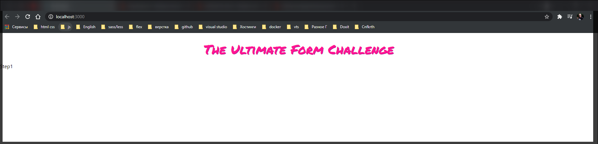
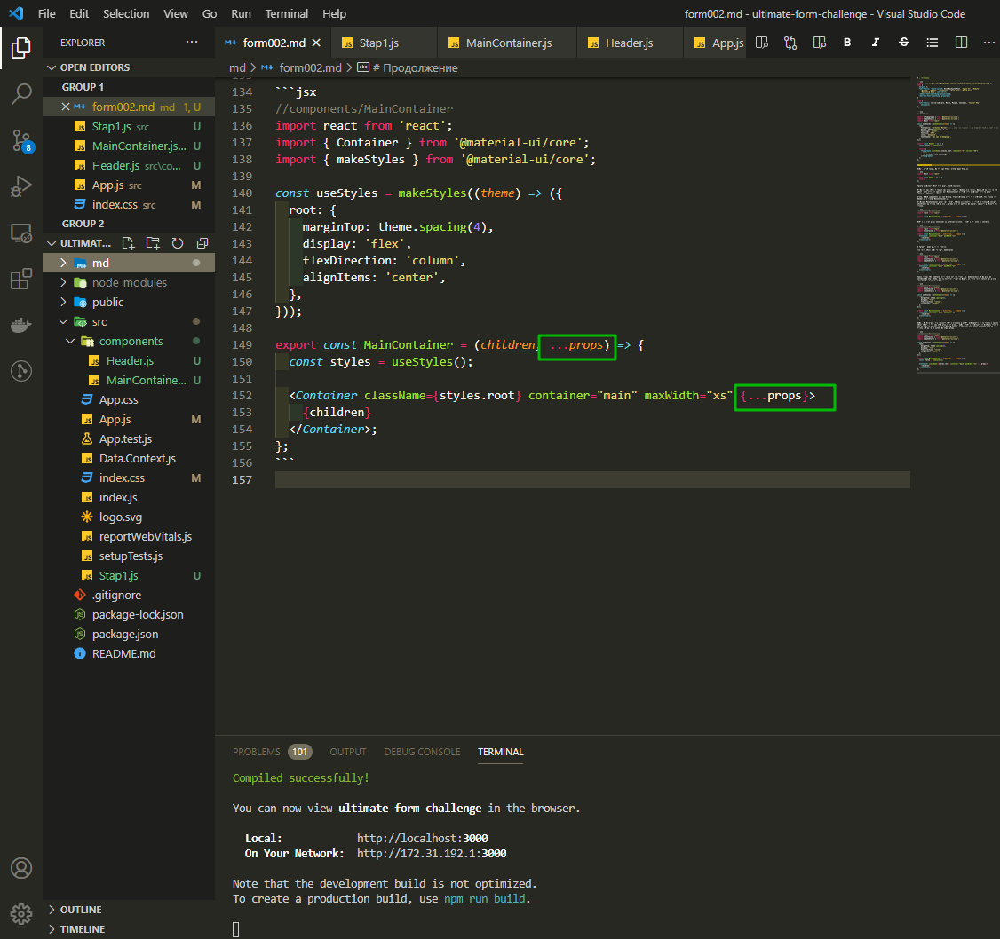
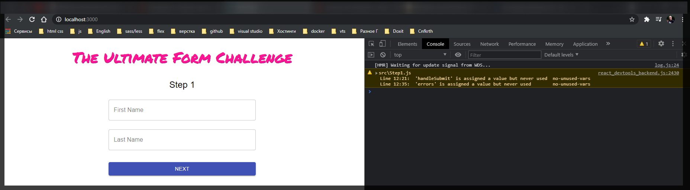

# Продолжение

```css
@import url('http://fonts.googleapis.com/css?family=Permanent+Marker&display=swap');
body {
  margin: 0;
  font-family: -apple-system, BlinkMacSystemFont, 'Segoe UI', 'Roboto',
    'Oxygen', 'Ubuntu', 'Cantarell', 'Fira Sans', 'Droid Sans',
    'Helvetica Neue', sans-serif;
  -webkit-font-smoothing: antialiased;
  -moz-osx-font-smoothing: grayscale;
}

code {
  font-family: source-code-pro, Menlo, Monaco, Consolas, 'Courier New',
    monospace;
}
```

```jsx
// Header.js

import { Typography } from '@material-ui/core';
import { makeStyles } from '@material-ui/core';
import React from 'react';

const useStyles = makeStyles((theme) => ({
  root: {
    fontFamily: 'Permanent Marker', // Прежде чем добавить сюда добави ссылку на шифт в css
    margin: theme.spacing(3, 0, 2),
    textAlign: 'center',
    fontSize: '40px',
    color: 'deeppink',
    textShadow: '1px 1px darkmagenta',
  },
}));

export const Header = () => {
  const styles = useStyles();

  return (
    <Typography className={styles.root} component="h1" variant="h5">
      {' '}
      The Ultimate Form Challenge
    </Typography>
  );
};
```



Теперь начну делать первый шаг **Step1**. Создаю файл **Step1.js**.

```jsx
//Step1.js
import React from 'react';

export const Step1 = () => {
  return;
};
```

Данный компонент будет возвращать следующие вещи:

Во-первых нам нужно в **layout** нам нужно сделать специальное окошко, панельку на которой все будет рендерится. Мы назовем его **MainContainer** и это просто компонент который будет рендерить панельку с тенью.

Создаю папку **components** и в нее помещаю два компонента которые я использую для стилей это **Header.js** и создаю **MainContainer.js**.

Компонент **MainContainer** будет оборачивать другие компоненты, по этому он должен принимать **children** и на всякий случай еще **...props** если мы захотим передавать какие-то аргументы для стилей.

```jsx
//components/MainContainer
import react from 'react';

export const MainContainer = (children, ...props) => {};
```

Внутри мы возвращаем **Container** из **Material-ui/core**. И внутри мы рендерим **children**.

```jsx
//components/MainContainer
import react from 'react';
import { Container } from '@material-ui/core';

export const MainContainer = (children, ...props) => {
  <Container container="main" maxWidth="xs">
    {children}
  </Container>;
};
```

И давайте разбираться со стилями.

Мне снова нужно импортировать **makeStyles**

```jsx
//components/MainContainer
import react from 'react';
import { Container } from '@material-ui/core';
import { makeStyles } from '@material-ui/core';

export const MainContainer = (children, ...props) => {
  <Container container="main" maxWidth="xs">
    {children}
  </Container>;
};
```

Далее создам хук **useStyles** который вернет эти стили т.е. **makeStyles()**. В параметрах **callback** передаю **theme**. Так же для того что бы не писать ключевое слово **return** оборачиваю тело цикла в круглые скобки.

```jsx
//components/MainContainer
import react from 'react';
import { Container } from '@material-ui/core';
import { makeStyles } from '@material-ui/core';

const useStyles = makeStyles((theme) => ({
  root: {
    marginTop: theme.spacing(4),
    display: 'flex',
    flexDirection: 'column',
    alignItems: 'center',
  },
}));

export const MainContainer = (children, ...props) => {
  <Container container="main" maxWidth="xs">
    {children}
  </Container>;
};
```

Теперь по умолчанию все элементы внутри контейнера будут располагатся по вертикали и нам не нужно думать о том как их правильно выравнить. Теперь внутри компонента мы получаем стили и так же если мы захотим что - то переопределить в каком-то конкретном контейнере мы на всякий случай чарез **spreed** передаем **props**.

```jsx
//components/MainContainer
import react from 'react';
import { Container } from '@material-ui/core';
import { makeStyles } from '@material-ui/core';

const useStyles = makeStyles((theme) => ({
  root: {
    marginTop: theme.spacing(4),
    display: 'flex',
    flexDirection: 'column',
    alignItems: 'center',
  },
}));

export const MainContainer = (children, ...props) => {
  const styles = useStyles();

  <Container className={styles.root} container="main" maxWidth="xs" {...props}>
    {children}
  </Container>;
};
```



Вот как мы их получили **...props** в аргументах и далее в неизмененном виде пробрасываем в контейнер.

Возвращаемся обратно в **Step1.js**

Импортирую **MainContainer**

```jsx
import { Typography } from '@material-ui/core';
import React from 'react';
import MainContainer from './components/MainContainer';

export const Step1 = () => {
  return (
    <MainContainer>
      <Typography>Step 1</Typography>
    </MainContainer>
  );
};
```

Так как элемент **Typography** может быть абсолютно любым элементом текста мы можем использовать **component="h2"** т.е. **header** 2-го уровня, и **variant="h5"**.

```jsx
import { Typography } from '@material-ui/core';
import React from 'react';
import MainContainer from './components/MainContainer';

export const Step1 = () => {
  return (
    <MainContainer>
      <Typography component="h2" variant="h5">
        Step 1
      </Typography>
    </MainContainer>
  );
};
```

После того как мы отрендерели заголовок мы можем рендерить саму форму. Мы могли бы напрямую сделать элемент **form**, но ее хочется сделать по красивее.

Для этого создаю новый элемент **Form.js** у которого будут правильные пропорции заданы.

```jsx
import React from 'react';
import { makeStyles } from '@material-ui/core/styles';

export const Form = ({ children, ...props }) => {
  return <form {...props}>{children}</form>;
};
```

Она будет рендерить форму, отображать вложенных в нее детей. А так же пробрасываю props для того если мы захотим форму настроить что бы она вела себя как обычный компонент формы. Мы **props** все пробрасываем а детей рендерим как детей.

Добавляем ей prop **noValidate** это нужно для того что бы обычная **html** валидация была отключена.

```jsx
import React from 'react';
import { makeStyles } from '@material-ui/core/styles';

export const Form = ({ children, ...props }) => {
  return (
    <form noValidate {...props}>
      {children}
    </form>
  );
};
```

И теперь разбираемся со стилями.

```jsx
//components.Form.js
import React from 'react';
import { makeStyles } from '@material-ui/core/styles';

const useStyles = makeStyles((theme) => ({
  root: {
    width: '100%',
    marginTop: theme.spacing(1),
  },
}));

export const Form = ({ children, ...props }) => {
  const styles = useStyles();

  return (
    <form {...props} className={styles.root} noValidate>
      {children}
    </form>
  );
};
```

Далее в **Step1.js** добавляю компонент **Form**, и у же в нем буду добавлять наши **input**.

```jsx
import { Typography } from '@material-ui/core';
import React from 'react';
import MainContainer from './components/MainContainer';
import Form from './components/Form';

export const Step1 = () => {
  return (
    <MainContainer>
      <Typography component="h2" variant="h5">
        Step 1
      </Typography>
      <Form></Form>
    </MainContainer>
  );
};
```

Теперь мы можем добавлять **input**. Однако мы хотим что бы и он был стилизован. Для него тоже создаю компонент. Это точно так же будет обертка вокруг обычного **html** **input**.

```jsx
import React, { forwardRef } from 'react';
import { TextField } from '@material-ui/core';

export const Input = forwardRef;
```

Я использую **forwardRef** мы используем этот метод для того что бы пробрасывать **ref** сам финальный елемент. Это нужно потому что **react-hook-form** использует **ref** ссылки на сами элементы **html** которые рендерятся для того что бы ими управлять. По-этому мы все оборачиваем в **forwardRef** из **react** что бы теперь получить не только **props** но и **ref**. Внутри мы рендерим **TextField** и передаю в него все **...props** что бы иметь полный контроль снаружи. В **variant** тут мы указываем по сути стилизацию. т.е. **variant="outlined"** **margin="normal"** **inputRef={ref}**. **Material-ui** позволяет принимать **ref**, просто там для этого используется отдельный специальный **prop**, а внутри оно уже переименовывается и передается как обычный **ref**.
И еще добавим **fullWidth** который растянет растянет его во всю ширину контейнера.

```jsx
import React, { forwardRef } from 'react';
import { TextField } from '@material-ui/core';

export const Input = forwardRef((props, ref) => {
  return (
    <TextField
      variant="outlined"
      margin="normal"
      inputRef={ref}
      fullWidth
      {...props}
    />
  );
});
```

Возвращаюсь в **Step1.js** и теперь я уже использую наш **Input**.

```jsx
import { Typography } from '@material-ui/core';
import React from 'react';
import MainContainer from './components/MainContainer';
import Form from './components/Form';
import Input from './components/Input';

export const Step1 = () => {
  return (
    <MainContainer>
      <Typography component="h2" variant="h5">
        Step 1
      </Typography>
      <Form>
        <Input />
      </Form>
    </MainContainer>
  );
};
```

В первую очередь нужно передать контроль над компонентом. Нам нужно передать **ref**. Как мы его получим?

Для этого мы сразу инициализируем форму. **const{register}**, **register** это будет наш **ref**, **const{register, handlerSubmit}**, **handlerSubmit** - это специальная функция в которой мы будем получать данные из формы когда мы будем ее **submit** но об этом чуть позже. И **errors** этот объект нам понадобится когда мы будем рендерить ошибки **const{register, handlerSubmit, errors} = useForm({})**. В **useForm** передадим опции **mode: "onBlur"** - что бы когда мы снимаем фокус с элемента он начинал валидацию.

```jsx
import { Typography } from '@material-ui/core';
import React from 'react';
import MainContainer from './components/MainContainer';
import Form from './components/Form';
import Input from './components/Input';

export const Step1 = () => {
  const { register, handleSubmit, errors } = useForm({
    mode: 'onBlur',
  });

  return (
    <MainContainer>
      <Typography component="h2" variant="h5">
        Step 1
      </Typography>
      <Form>
        <Input />
      </Form>
    </MainContainer>
  );
};
```

Теперь в **Input** я могу передать в качестве **ref** **register** и следующие аргументы **id="firstName"** **type="text"** **label="First Name"** **name="firstName"**. **name="firstName"** - это имя компонента, от него **name=""** будет зависить поле которое мы получим в обработчике формы **handleSubmit** т.е. поле данных.

```jsx
import { Typography } from '@material-ui/core';
import React from 'react';
import MainContainer from './components/MainContainer';
import Form from './components/Form';
import Input from './components/Input';

export const Step1 = () => {
  const { register, handleSubmit, errors } = useForm({
    mode: 'onBlur',
  });

  return (
    <MainContainer>
      <Typography component="h2" variant="h5">
        Step 1
      </Typography>
      <Form>
        <Input
          ref={register}
          id="firstName"
          type="text"
          label="First Name"
          name="firstName"
        />
      </Form>
    </MainContainer>
  );
};
```

Теперь такой же **Input** для фамилии.

```jsx
import { Typography } from '@material-ui/core';
import React from 'react';
import MainContainer from './components/MainContainer';
import Form from './components/Form';
import Input from './components/Input';

export const Step1 = () => {
  const { register, handleSubmit, errors } = useForm({
    mode: 'onBlur',
  });

  return (
    <MainContainer>
      <Typography component="h2" variant="h5">
        Step 1
      </Typography>
      <Form>
        <Input
          ref={register}
          id="firstName"
          type="text"
          label="First Name"
          name="firstName"
        />
        <Input
          ref={register}
          id="lastName"
          type="text"
          label="Last Name"
          name="lastName"
        />
      </Form>
    </MainContainer>
  );
};
```

Теперь нужно добавить кнопку которая будет выполнять роль **submit**. Кнопка для того что бы переходить на следующий шаг.

Опять же она будет стилизованная и мы ее вынесем в компоненты. Создаю новый файл **PrimaryButton.js**.

```jsx
import React from 'react';

export const PrimaryButton = ({ children, props }) => {
  return;
};
```

Здесь мы так же получаем **children** и **props** как в других компонентах. Здесь мы так же возвращаем компонент **Button** из **@material-ui/core**, передаю **children**. Передаю тип **type="submit"** и пробрасываю **props**. так же задаю **fullWidth** для того что бы она занимала всю ширину контейнера, **variant="contained"** для того что бы она была заполнена сплошным цветом, и **color="prymary"**

```jsx
//components/PrimaryButton.js
import React from 'react';
import { Button } from '@material-ui/core';

export const PrimaryButton = ({ children, props }) => {
  return (
    <Button
      type="submit"
      fullWidth
      variant="contained"
      color="primary"
      {...props}
    >
      {children}
    </Button>
  );
};
```

Теперь еще немного зададим еще стилей.

```jsx
//components/PrimaryButton.js
import React from 'react';
import { Button } from '@material-ui/core';
import { makeStyles } from '@material-ui/core';

const useStyles = makeStyles((theme) => ({
  root: {
    margin: theme.spacing(3, 0, 2),
  },
}));

export const PrimaryButton = ({ children, props }) => {
  const styles = useStyles();

  return (
    <Button
      className={styles.root}
      type="submit"
      fullWidth
      variant="contained"
      color="primary"
      {...props}
    >
      {children}
    </Button>
  );
};
```

Кнопка готова. переходим обратно в **Step1.js** и в самом низу формы добавляю кнопку.

```jsx
import { Typography } from '@material-ui/core';
import React from 'react';
import { useForm } from 'react-hook-form';

import MainContainer from './components/MainContainer';
import Form from './components/Form';
import Input from './components/Input';
import PrimaryButton from './components/PrimaryButton';

export const Step1 = () => {
  const { register, handleSubmit, errors } = useForm({
    mode: 'onBlur',
  });

  return (
    <MainContainer>
      <Typography component="h2" variant="h5">
        Step 1
      </Typography>
      <Form>
        <Input
          ref={register}
          id="firstName"
          type="text"
          label="First Name"
          name="firstName"
        />
        <Input
          ref={register}
          id="lastName"
          type="text"
          label="Last Name"
          name="lastName"
        />
        <PrimaryButton>Next</PrimaryButton>
      </Form>
    </MainContainer>
  );
};
```

И теперь в **App.js** заменю фейковый **Step1** на настоящий.

```jsx
import React from 'react';
import { BrowserRouter as Router, Route, Switch } from 'react-router-dom';

import { Header } from './components/Header';
import { Step1 } from './Step1';

const Step2 = () => <>Step2</>;
const Step3 = () => <>Step3</>;
const Result = () => <>result</>;

function App() {
  return (
    <>
      <Header />
      <Router>
        <Switch>
          <Route exact path="/" component={Step1} />
          <Route path="/step2" component={Step2} />
          <Route path="/step3" component={Step3} />
          <Route path="/result" component={Result} />
        </Switch>
      </Router>
    </>
  );
}

export default App;
```


