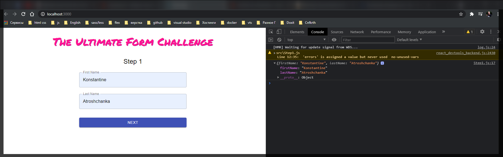
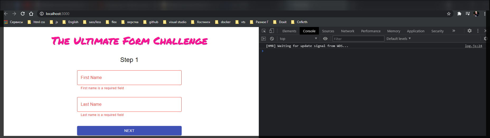
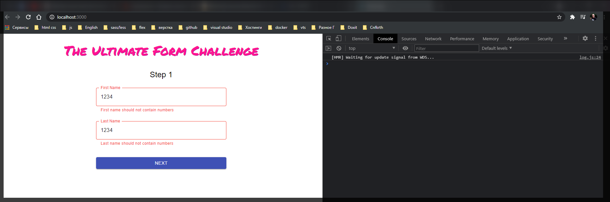

# Продолжение

Теперь в **Step1.js** добавляю обработчик отправки данных. Для этого в нашем **Form** мы добавим handlet **onSubmit={}** внутрь которого передадим **handleSubmit** который мы получили из **react-hook-form**, который уже добавим в наш **handlerSubmit(onSubmit)**.

```jsx
//Step1.js
import React from 'react';
import { Typography } from '@material-ui/core';
import { useForm } from 'react-hook-form';

import { MainContainer } from './components/MainContainer';
import { Form } from './components/Form';
import { Input } from './components/Input';
import { PrimaryButton } from './components/PrimaryButton';

export const Step1 = () => {
  const { register, handleSubmit, errors } = useForm({
    mode: 'onBlur',
  });

  return (
    <MainContainer>
      <Typography component="h2" variant="h5">
        Step 1
      </Typography>
      <Form onSubmit={handleSubmit(onSubmit)}>
        <Input
          ref={register}
          id="firstName"
          type="text"
          label="First Name"
          name="firstName"
        />
        <Input
          ref={register}
          id="lastName"
          type="text"
          label="Last Name"
          name="lastName"
        />
        <PrimaryButton>Next</PrimaryButton>
      </Form>
    </MainContainer>
  );
};
```

Теперь создадим функцию **onSubmit**. В параметрах этой функции я буду сразу получать **data**, т.е. нам парсить ничего не нужно, т.е. мы получим объект с заполненными полями. И для начало просто выведем их в консоль.

```jsx
//Step1.js
import React from 'react';
import { Typography } from '@material-ui/core';
import { useForm } from 'react-hook-form';

import { MainContainer } from './components/MainContainer';
import { Form } from './components/Form';
import { Input } from './components/Input';
import { PrimaryButton } from './components/PrimaryButton';

export const Step1 = () => {
  const { register, handleSubmit, errors } = useForm({
    mode: 'onBlur',
  });

  const onSubmit = (data) => {
    console.log(data);
  };

  return (
    <MainContainer>
      <Typography component="h2" variant="h5">
        Step 1
      </Typography>
      <Form onSubmit={handleSubmit(onSubmit)}>
        <Input
          ref={register}
          id="firstName"
          type="text"
          label="First Name"
          name="firstName"
        />
        <Input
          ref={register}
          id="lastName"
          type="text"
          label="Last Name"
          name="lastName"
        />
        <PrimaryButton>Next</PrimaryButton>
      </Form>
    </MainContainer>
  );
};
```



И вот за нас большая работа проделывается **react-hook-form** выдергиваются данные из формы.

Теперь напишем обработку ошибок. Для валидации мы будем использовать **yup**. Для этого нам нужно описать схему данных **const schema = yup.object()** т.е. данные у нас это объект. **yup.object().shape({})**. **shape** в переводе форма. В объекте указываю два поля **firstName: yup**.**string()** которая должна быть только с буквами латинского алфавита. Для этого использую свойство **firstName: yup.string().matches()** и здесь указываю регулярное выражение.

- **//** Обертка выражения
- **^** указывает начало строки
- **()** группа
- **[^0-9]** из не цифр
- **\*** означает что мы повторяем предыдущее выражение сколько угодно раз
- **$** означает конец строки

Если у нас обнаруживаются цифры при вводе то мы выводим следующую ошибку **First name should not contain number**. и далее добавляю еще одно условие **required("First name is a required field")**. **required** указывает на то что данное поле обязательно к заполенению.

Нам потребуется поле **lastName** и оно абсолютно такое же как и **firsName**.

```jsx
//Step1.js
import React from 'react';
import { Typography } from '@material-ui/core';
import { useForm } from 'react-hook-form';
import * as yup from 'yup';

import { MainContainer } from './components/MainContainer';
import { Form } from './components/Form';
import { Input } from './components/Input';
import { PrimaryButton } from './components/PrimaryButton';

const schema = yup.object().shape({
  firstName: yup
    .string()
    .matches(/^([^0-9]*)$/, 'First name should not contain number')
    .required('First name is a required field'),
  lastName: yup
    .string()
    .match(/^([^0-9]*)$/, 'Last name should not contain number')
    .required('Last name is a required field'),
});

export const Step1 = () => {
  const { register, handleSubmit, errors } = useForm({
    mode: 'onBlur',
  });

  const onSubmit = (data) => {
    console.log(data);
  };

  return (
    <MainContainer>
      <Typography component="h2" variant="h5">
        Step 1
      </Typography>
      <Form onSubmit={handleSubmit(onSubmit)}>
        <Input
          ref={register}
          id="firstName"
          type="text"
          label="First Name"
          name="firstName"
        />
        <Input
          ref={register}
          id="lastName"
          type="text"
          label="Last Name"
          name="lastName"
        />
        <PrimaryButton>Next</PrimaryButton>
      </Form>
    </MainContainer>
  );
};
```

Теперь ее нужно как-то передать в форму. Для этого в **useForm** передаю поле **resolver: yupResolver(shema)**

```jsx
//Step1.js
import React from 'react';
import { Typography } from '@material-ui/core';
import { useForm } from 'react-hook-form';
import * as yup from 'yup';

import { MainContainer } from './components/MainContainer';
import { Form } from './components/Form';
import { Input } from './components/Input';
import { PrimaryButton } from './components/PrimaryButton';

const schema = yup.object().shape({
  firstName: yup
    .string()
    .matches(/^([^0-9]*)$/, 'First name should not contain number')
    .required('First name is a required field'),
  lastName: yup
    .string()
    .match(/^([^0-9]*)$/, 'Last name should not contain number')
    .required('Last name is a required field'),
});

export const Step1 = () => {
  const { register, handleSubmit, errors } = useForm({
    mode: 'onBlur',
    resolver: yupResolver(schema),
  });

  const onSubmit = (data) => {
    console.log(data);
  };

  return (
    <MainContainer>
      <Typography component="h2" variant="h5">
        Step 1
      </Typography>
      <Form onSubmit={handleSubmit(onSubmit)}>
        <Input
          ref={register}
          id="firstName"
          type="text"
          label="First Name"
          name="firstName"
        />
        <Input
          ref={register}
          id="lastName"
          type="text"
          label="Last Name"
          name="lastName"
        />
        <PrimaryButton>Next</PrimaryButton>
      </Form>
    </MainContainer>
  );
};
```

Для того что бы использовать **yupResolver** нам нужно установить еще один пакет

```shell
npm i @hookform/resolvers
```

[https://www.npmjs.com/package/@hookform/resolvers](https://www.npmjs.com/package/@hookform/resolvers)

```jsx
//Step1.js
import React from 'react';
import { Typography } from '@material-ui/core';
import { useForm } from 'react-hook-form';
import { yupResolver } from '@hookform/resolvers/yup';
import * as yup from 'yup';

import { MainContainer } from './components/MainContainer';
import { Form } from './components/Form';
import { Input } from './components/Input';
import { PrimaryButton } from './components/PrimaryButton';

const schema = yup.object().shape({
  firstName: yup
    .string()
    .matches(/^([^0-9]*)$/, 'First name should not contain number')
    .required('First name is a required field'),
  lastName: yup
    .string()
    .match(/^([^0-9]*)$/, 'Last name should not contain number')
    .required('Last name is a required field'),
});

export const Step1 = () => {
  const { register, handleSubmit, errors } = useForm({
    mode: 'onBlur',
    resolver: yupResolver(schema),
  });

  const onSubmit = (data) => {
    console.log(data);
  };

  return (
    <MainContainer>
      <Typography component="h2" variant="h5">
        Step 1
      </Typography>
      <Form onSubmit={handleSubmit(onSubmit)}>
        <Input
          ref={register}
          id="firstName"
          type="text"
          label="First Name"
          name="firstName"
        />
        <Input
          ref={register}
          id="lastName"
          type="text"
          label="Last Name"
          name="lastName"
        />
        <PrimaryButton>Next</PrimaryButton>
      </Form>
    </MainContainer>
  );
};
```

Теперь для того что бы отображать ошибку необходимо передать саму **error** в **Input**. Мы передаем булево значение по этому я передаю два **!!** для того что бы привести его к булеву значению **error={!!errors.firstName}**. И **helperText** у нас должен быть собственно текстом ошибки.

```jsx
//Step1.js
import React from 'react';
import { Typography } from '@material-ui/core';
import { useForm } from 'react-hook-form';
import { yupResolver } from '@hookform/resolvers/yup';
import * as yup from 'yup';

import { MainContainer } from './components/MainContainer';
import { Form } from './components/Form';
import { Input } from './components/Input';
import { PrimaryButton } from './components/PrimaryButton';

const schema = yup.object().shape({
  firstName: yup
    .string()
    .matches(/^([^0-9]*)$/, 'First name should not contain numbers')
    .required('First name is a required field'),
  lastName: yup
    .string()
    .matches(/^([^0-9]*)$/, 'Last name should not contain numbers')
    .required('Last name is a required field'),
});

export const Step1 = () => {
  const { register, handleSubmit, errors } = useForm({
    mode: 'onBlur',
    resolver: yupResolver(schema),
  });

  const onSubmit = (data) => {
    console.log(data);
  };

  return (
    <MainContainer>
      <Typography component="h2" variant="h5">
        Step 1
      </Typography>
      <Form onSubmit={handleSubmit(onSubmit)}>
        <Input
          ref={register}
          id="firstName"
          type="text"
          label="First Name"
          name="firstName"
          error={!!errors.firstName}
          helperText={errors?.firstName?.message}
        />
        <Input
          ref={register}
          id="lastName"
          type="text"
          label="Last Name"
          name="lastName"
          error={!!errors.lastName}
          helperText={errors?.lastName?.message}
        />
        <PrimaryButton>Next</PrimaryButton>
      </Form>
    </MainContainer>
  );
};
```




