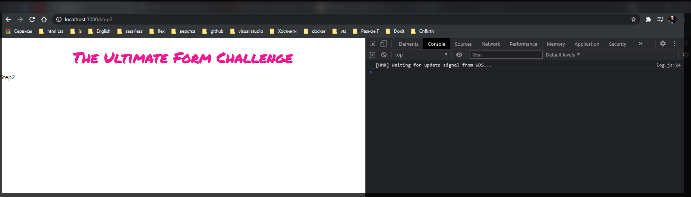
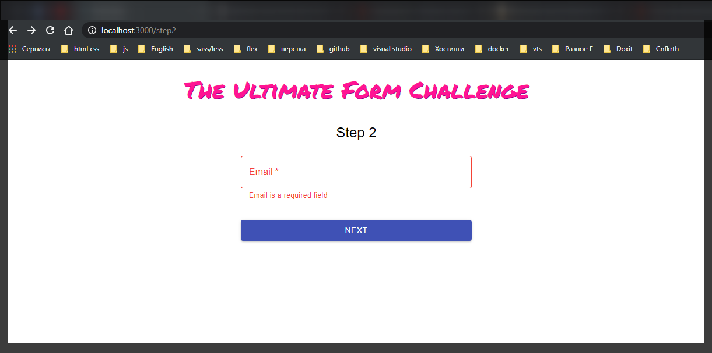
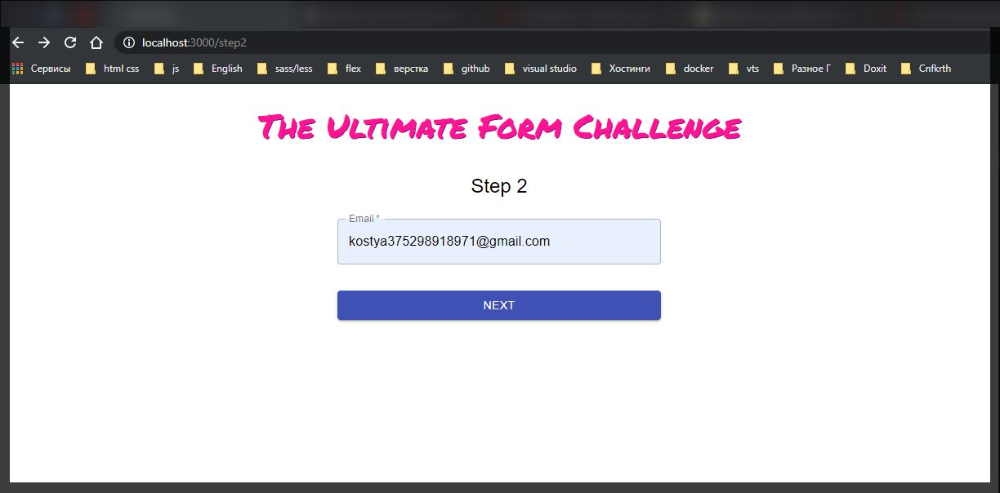
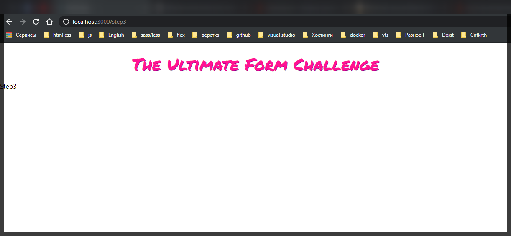

# Продолжение.

Следующий шаг это когда мы нажмем **NEXT** нас перекинуло на следующий шаг.

И теперь нам нужно получить объект **history** что бы в него записать следующую страницу. Это мы делаем при помощи специального хука **const history = useHistory()**. из **import {useHistory} from 'react-router-dom'**.

```jsx
//Step1.js
import React from 'react';
import { Typography } from '@material-ui/core';
import { useForm } from 'react-hook-form';
import { yupResolver } from '@hookform/resolvers/yup';
import * as yup from 'yup';

import { useHistory } from 'react-router-dom';

import { MainContainer } from './components/MainContainer';
import { Form } from './components/Form';
import { Input } from './components/Input';
import { PrimaryButton } from './components/PrimaryButton';

const schema = yup.object().shape({
  firstName: yup
    .string()
    .matches(/^([^0-9]*)$/, 'First name should not contain numbers')
    .required('First name is a required field'),
  lastName: yup
    .string()
    .matches(/^([^0-9]*)$/, 'Last name should not contain numbers')
    .required('Last name is a required field'),
});

export const Step1 = () => {
  const history = useHistory();

  const { register, handleSubmit, errors } = useForm({
    mode: 'onBlur',
    resolver: yupResolver(schema),
  });

  const onSubmit = (data) => {
    console.log(data);
  };

  return (
    <MainContainer>
      <Typography component="h2" variant="h5">
        Step 1
      </Typography>
      <Form onSubmit={handleSubmit(onSubmit)}>
        <Input
          ref={register}
          id="firstName"
          type="text"
          label="First Name"
          name="firstName"
          error={!!errors.firstName}
          helperText={errors?.firstName?.message}
        />
        <Input
          ref={register}
          id="lastName"
          type="text"
          label="Last Name"
          name="lastName"
          error={!!errors.lastName}
          helperText={errors?.lastName?.message}
        />
        <PrimaryButton>Next</PrimaryButton>
      </Form>
    </MainContainer>
  );
};
```

И теперь в функции **onSubmit** я прописываю **history.push("/step2")**

```jsx
//Step1.js
import React from 'react';
import { Typography } from '@material-ui/core';
import { useForm } from 'react-hook-form';
import { yupResolver } from '@hookform/resolvers/yup';
import * as yup from 'yup';

import { useHistory } from 'react-router-dom';

import { MainContainer } from './components/MainContainer';
import { Form } from './components/Form';
import { Input } from './components/Input';
import { PrimaryButton } from './components/PrimaryButton';

const schema = yup.object().shape({
  firstName: yup
    .string()
    .matches(/^([^0-9]*)$/, 'First name should not contain numbers')
    .required('First name is a required field'),
  lastName: yup
    .string()
    .matches(/^([^0-9]*)$/, 'Last name should not contain numbers')
    .required('Last name is a required field'),
});

export const Step1 = () => {
  const history = useHistory();

  const { register, handleSubmit, errors } = useForm({
    mode: 'onBlur',
    resolver: yupResolver(schema),
  });

  const onSubmit = (data) => {
    history.push('/step2');
  };

  return (
    <MainContainer>
      <Typography component="h2" variant="h5">
        Step 1
      </Typography>
      <Form onSubmit={handleSubmit(onSubmit)}>
        <Input
          ref={register}
          id="firstName"
          type="text"
          label="First Name"
          name="firstName"
          error={!!errors.firstName}
          helperText={errors?.firstName?.message}
        />
        <Input
          ref={register}
          id="lastName"
          type="text"
          label="Last Name"
          name="lastName"
          error={!!errors.lastName}
          helperText={errors?.lastName?.message}
        />
        <PrimaryButton>Next</PrimaryButton>
      </Form>
    </MainContainer>
  );
};
```



И теперь при клике на кнопку происходит переход на **step2**.

На этом шаге мы будем обрабатывать адрес электронной почты и телефона. И у нас будет опциональное поле которое мы можем включать/выключать.

Создаю новый компонент **Step2.js** в котором возвращаю похожую конфигурацию....

```jsx
//Step2.js
import React from 'react';
import { Typography } from '@material-ui/core';
import { MainContainer } from './components/MainContainer';

export const Step2 = () => {
  return (
    <MainContainer>
      <Typography component="h2" variant="h5">
        Step 2
      </Typography>
    </MainContainer>
  );
};
```

Далее добавляю **Form** и **Input**.

```jsx
//Step2.js
import React from 'react';
import { Typography } from '@material-ui/core';
import { MainContainer } from './components/MainContainer';

import { Form } from './components/Form';
import { Input } from './components/Input';

export const Step2 = () => {
  return (
    <MainContainer>
      <Typography component="h2" variant="h5">
        Step 2
      </Typography>
      <Form>
        <Input id="email" type="email" label="Email" name="email" required />
      </Form>
    </MainContainer>
  );
};
```

Теперь мы сразу же можем проинициализировать форму. Но при инициализации нам потребуется не только **register**, **handleSubmit**,**errors**, но и **watch** для того что бы когда данные будут меняться мы за ними смогли следить и в реальном времени обновлять то что показывается. Нам потребуется это когда мы будем показывать поле ввода телефонного номера и активировать его по **checkbox**.

И при нинициалазации сразу в useForm передаю объект с конфигурацией в который передаю **mode: 'onBlur'**.

```jsx
//Step2.js
import React from 'react';
import { Typography } from '@material-ui/core';
import { MainContainer } from './components/MainContainer';
import { useForm } from 'react-hook-form';

import { Form } from './components/Form';
import { Input } from './components/Input';

export const Step2 = () => {
  const { register, handleSubmit, errors, watch } = useForm({
    mode: 'onBlur',
  });

  return (
    <MainContainer>
      <Typography component="h2" variant="h5">
        Step 2
      </Typography>
      <Form>
        <Input id="email" type="email" label="Email" name="email" required />
      </Form>
    </MainContainer>
  );
};
```

Сразу объявлю обработчик формы **onSubmit** Которая будет переходить на третий шаг. Для того что бы получить **history** надо получить хук **useHistory** из **react-router-dom**.

```jsx
//Step2.js
import React from 'react';
import { Typography } from '@material-ui/core';
import { MainContainer } from './components/MainContainer';
import { useForm } from 'react-hook-form';
import { useHistory } from 'react-router-dom';

import { Form } from './components/Form';
import { Input } from './components/Input';

export const Step2 = () => {
  const history = useHistory();

  const { register, handleSubmit, errors, watch } = useForm({
    mode: 'onBlur',
  });

  const onSubmit = (data) => {
    history.push('/step3');
  };

  return (
    <MainContainer>
      <Typography component="h2" variant="h5">
        Step 2
      </Typography>
      <Form>
        <Input id="email" type="email" label="Email" name="email" required />
      </Form>
    </MainContainer>
  );
};
```

Самый начальный **setup** готов.

Теперь добавляю кнопку

```jsx
//Step2.js
import React from 'react';
import { Typography } from '@material-ui/core';
import { MainContainer } from './components/MainContainer';
import { useForm } from 'react-hook-form';
import { useHistory } from 'react-router-dom';

import { Form } from './components/Form';
import { Input } from './components/Input';
import { PrimaryButton } from './components/PrimaryButton';

export const Step2 = () => {
  const history = useHistory();

  const { register, handleSubmit, errors, watch } = useForm({
    mode: 'onBlur',
  });

  const onSubmit = (data) => {
    history.push('/step3');
  };

  return (
    <MainContainer>
      <Typography component="h2" variant="h5">
        Step 2
      </Typography>
      <Form>
        <Input id="email" type="email" label="Email" name="email" required />
        <PrimaryButton>Next</PrimaryButton>
      </Form>
    </MainContainer>
  );
};
```

Добавляю обработку ошибок. Логика такая же как и в предыдущем шаге **Step1.js**. Создаю **schema = yup.object().shape({})**. И прописываю валидируемое поле **email: yup.string()** и здесь уже встроенный валидатор **email** применяем т.е. **email: yup.string().email("")**

```jsx
//Step2.js
import React from 'react';
import { Typography } from '@material-ui/core';
import { MainContainer } from './components/MainContainer';
import { useForm } from 'react-hook-form';
import { useHistory } from 'react-router-dom';
import * as yup from 'yup';

import { Form } from './components/Form';
import { Input } from './components/Input';
import { PrimaryButton } from './components/PrimaryButton';

const schema = yup.object().shape({
  email: yup
    .string()
    .email('Email should have  correct format')
    .required('Email is a required field'),
});

export const Step2 = () => {
  const history = useHistory();

  const { register, handleSubmit, errors, watch } = useForm({
    mode: 'onBlur',
  });

  const onSubmit = (data) => {
    history.push('/step3');
  };

  return (
    <MainContainer>
      <Typography component="h2" variant="h5">
        Step 2
      </Typography>
      <Form>
        <Input id="email" type="email" label="Email" name="email" required />
        <PrimaryButton>Next</PrimaryButton>
      </Form>
    </MainContainer>
  );
};
```

Теперь в **useForm** передаю **resolver: yupResolver(schema)**

```jsx
//Step2.js
import React from 'react';
import { Typography } from '@material-ui/core';
import { MainContainer } from './components/MainContainer';
import { useForm } from 'react-hook-form';
import { useHistory } from 'react-router-dom';
import * as yup from 'yup';

import { Form } from './components/Form';
import { Input } from './components/Input';
import { PrimaryButton } from './components/PrimaryButton';
import { yupResolver } from '@hookform/resolvers/yup';

const schema = yup.object().shape({
  email: yup
    .string()
    .email('Email should have  correct format')
    .required('Email is a required field'),
});

export const Step2 = () => {
  const history = useHistory();

  const { register, handleSubmit, errors, watch } = useForm({
    mode: 'onBlur',
    resolver: yupResolver(schema),
  });

  const onSubmit = (data) => {
    history.push('/step3');
  };

  return (
    <MainContainer>
      <Typography component="h2" variant="h5">
        Step 2
      </Typography>
      <Form>
        <Input id="email" type="email" label="Email" name="email" required />
        <PrimaryButton>Next</PrimaryButton>
      </Form>
    </MainContainer>
  );
};
```

и дальше передаю ошибки. В **Input** прописываю **errors={}**, для того что бы перевести в булево ставлю **!!** и передаю **errors.email**. Кароче кроме этого в **Form** прописываю действие в который передаю обработчик формы и на **Input** вешаю **ref**.

```jsx
//Step2.js
import React from 'react';
import { Typography } from '@material-ui/core';
import { MainContainer } from './components/MainContainer';
import { useForm } from 'react-hook-form';
import { useHistory } from 'react-router-dom';
import * as yup from 'yup';

import { Form } from './components/Form';
import { Input } from './components/Input';
import { PrimaryButton } from './components/PrimaryButton';
import { yupResolver } from '@hookform/resolvers/yup';

const schema = yup.object().shape({
  email: yup
    .string()
    .email('Email should have  correct format')
    .required('Email is a required field'),
});

export const Step2 = () => {
  const history = useHistory();

  const { register, handleSubmit, errors, watch } = useForm({
    mode: 'onBlur',
    resolver: yupResolver(schema),
  });

  const onSubmit = (data) => {
    history.push('/step3');
  };

  return (
    <MainContainer>
      <Typography component="h2" variant="h5">
        Step 2
      </Typography>
      <Form onSubmit={handleSubmit(onSubmit)}>
        <Input
          ref={register}
          id="email"
          type="email"
          label="Email"
          name="email"
          required
          error={!!errors.email}
          helperText={errors?.email?.message}
        />
        <PrimaryButton>Next</PrimaryButton>
      </Form>
    </MainContainer>
  );
};
```






