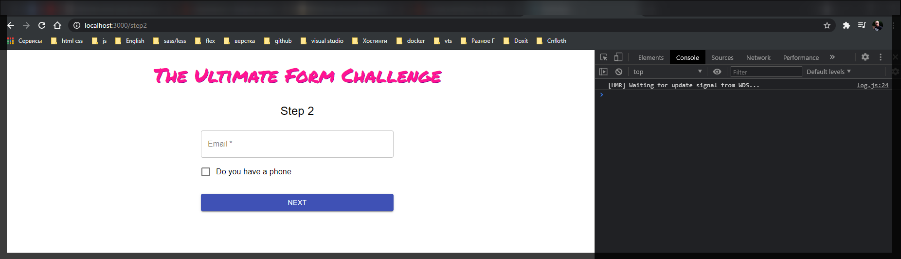
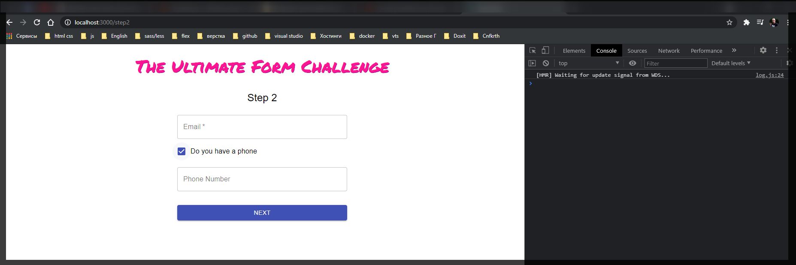
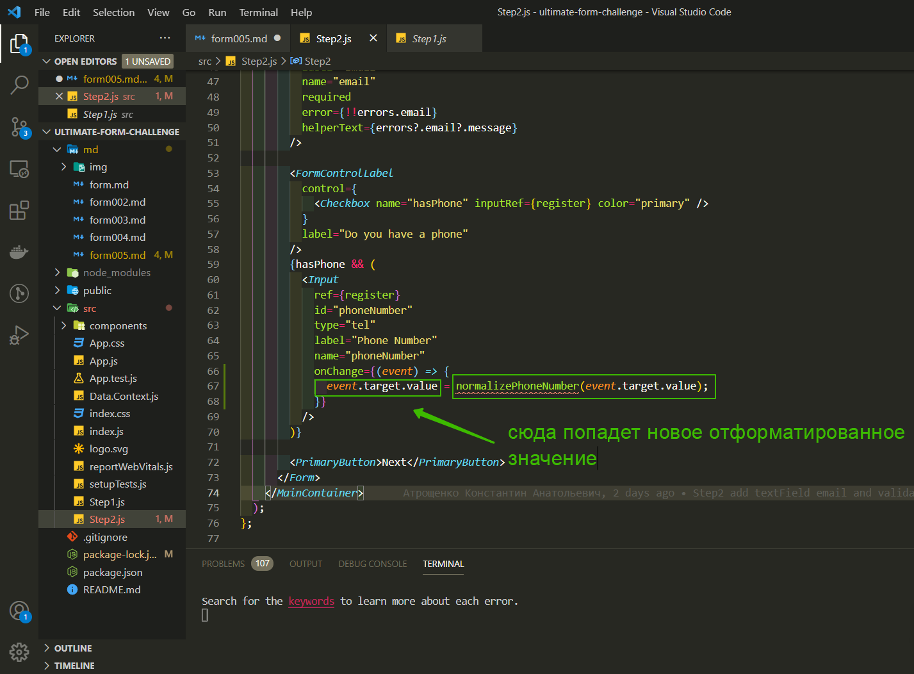
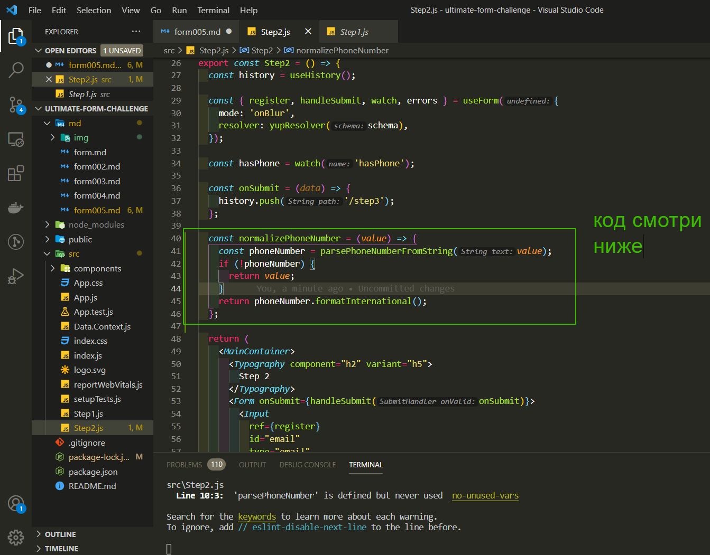
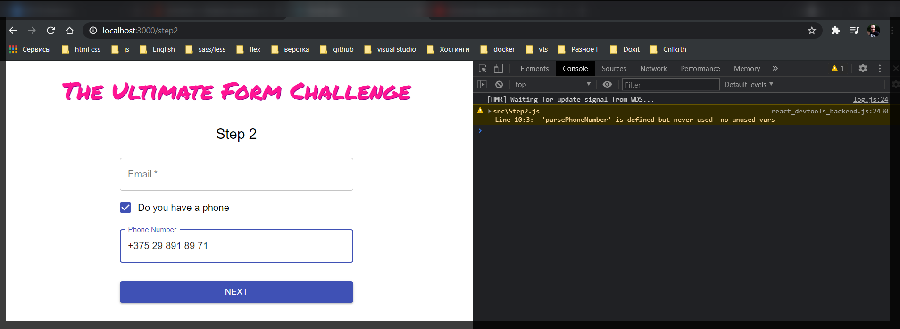
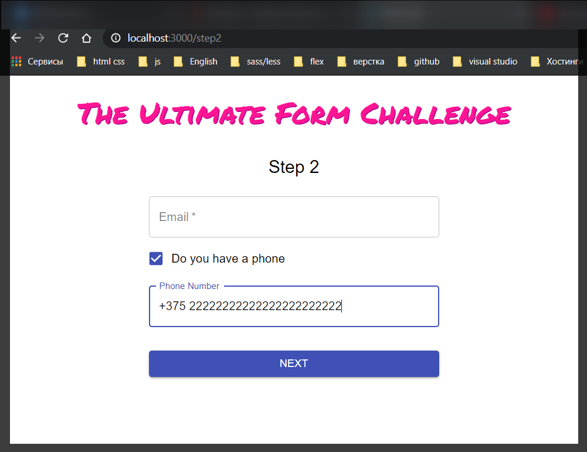

# Идем дальше

теперь добавлю **checkbox** который будет активировать **input** телефонного номера.
После **input** **email** я добавляю еще один компонент **FormControlLabel** это специальный компонент что бы работать со всякими **checkbox** контролами в **material-ui**.

```jsx
//Step2.js
import React from 'react';
import { FormControlLabel, Typography } from '@material-ui/core';
import { MainContainer } from './components/MainContainer';
import { useForm } from 'react-hook-form';
import { useHistory } from 'react-router-dom';
import * as yup from 'yup';

import { Form } from './components/Form';
import { Input } from './components/Input';
import { PrimaryButton } from './components/PrimaryButton';
import { yupResolver } from '@hookform/resolvers/yup';

const schema = yup.object().shape({
  email: yup
    .string()
    .email('Email should have  correct format')
    .required('Email is a required field'),
});

export const Step2 = () => {
  const history = useHistory();

  const { register, handleSubmit, errors, watch } = useForm({
    mode: 'onBlur',
    resolver: yupResolver(schema),
  });

  const onSubmit = (data) => {
    history.push('/step3');
  };

  return (
    <MainContainer>
      <Typography component="h2" variant="h5">
        Step 2
      </Typography>
      <Form onSubmit={handleSubmit(onSubmit)}>
        <Input
          ref={register}
          id="email"
          type="email"
          label="Email"
          name="email"
          required
          error={!!errors.email}
          helperText={errors?.email?.message}
        />
        <FormControlLabel />

        <PrimaryButton>Next</PrimaryButton>
      </Form>
    </MainContainer>
  );
};
```

В атрибутах **FormControlLabel** указываю **label="Do you have a phone"**. И указываю сам **control** т.е. то чем этот компонент будет управлять **control={\<Checkbox />}**

```jsx
//Step2.js
import React from 'react';
import { Checkbox, FormControlLabel, Typography } from '@material-ui/core';
import { MainContainer } from './components/MainContainer';
import { useForm } from 'react-hook-form';
import { useHistory } from 'react-router-dom';
import * as yup from 'yup';

import { Form } from './components/Form';
import { Input } from './components/Input';
import { PrimaryButton } from './components/PrimaryButton';
import { yupResolver } from '@hookform/resolvers/yup';

const schema = yup.object().shape({
  email: yup
    .string()
    .email('Email should have  correct format')
    .required('Email is a required field'),
});

export const Step2 = () => {
  const history = useHistory();

  const { register, handleSubmit, errors, watch } = useForm({
    mode: 'onBlur',
    resolver: yupResolver(schema),
  });

  const onSubmit = (data) => {
    history.push('/step3');
  };

  return (
    <MainContainer>
      <Typography component="h2" variant="h5">
        Step 2
      </Typography>
      <Form onSubmit={handleSubmit(onSubmit)}>
        <Input
          ref={register}
          id="email"
          type="email"
          label="Email"
          name="email"
          required
          error={!!errors.email}
          helperText={errors?.email?.message}
        />
        <FormControlLabel control={<Checkbox />} label="Do you have a phone" />

        <PrimaryButton>Next</PrimaryButton>
      </Form>
    </MainContainer>
  );
};
```

И теперь в самом **Checkbox** указываю **name="hasPhone"**, **inputRef={}** что бы им могла управлять наша **react-hook-form**. В **inputRef={}** указываю **register** и указываю цвет **color="primary"**.

```jsx
//Step2.js
import React from 'react';
import { Checkbox, FormControlLabel, Typography } from '@material-ui/core';
import { MainContainer } from './components/MainContainer';
import { useForm } from 'react-hook-form';
import { useHistory } from 'react-router-dom';
import * as yup from 'yup';

import { Form } from './components/Form';
import { Input } from './components/Input';
import { PrimaryButton } from './components/PrimaryButton';
import { yupResolver } from '@hookform/resolvers/yup';

const schema = yup.object().shape({
  email: yup
    .string()
    .email('Email should have  correct format')
    .required('Email is a required field'),
});

export const Step2 = () => {
  const history = useHistory();

  const { register, handleSubmit, errors, watch } = useForm({
    mode: 'onBlur',
    resolver: yupResolver(schema),
  });

  const onSubmit = (data) => {
    history.push('/step3');
  };

  return (
    <MainContainer>
      <Typography component="h2" variant="h5">
        Step 2
      </Typography>
      <Form onSubmit={handleSubmit(onSubmit)}>
        <Input
          ref={register}
          id="email"
          type="email"
          label="Email"
          name="email"
          required
          error={!!errors.email}
          helperText={errors?.email?.message}
        />
        <FormControlLabel
          control={
            <Checkbox name="hasPhone" inputRef={register} color="primary" />
          }
          label="Do you have a phone"
        />

        <PrimaryButton>Next</PrimaryButton>
      </Form>
    </MainContainer>
  );
};
```

Теперь мы сможем следить за значением этого поля в форме в реальном времени когда оно будет обновляться.

Где-нибудь вверху документа добавляю специальную костанту которая будет следить за полем **const hasPhone =** , а следить оа будет при помощи метода **watch** который я упоменал ранее. Она будет автоматически обновлять значение константы **const hasPhone = watch('hasPhone');**

```jsx
//Step2.js
import React from 'react';
import { Checkbox, FormControlLabel, Typography } from '@material-ui/core';
import { MainContainer } from './components/MainContainer';
import { useForm } from 'react-hook-form';
import { useHistory } from 'react-router-dom';
import * as yup from 'yup';

import { Form } from './components/Form';
import { Input } from './components/Input';
import { PrimaryButton } from './components/PrimaryButton';
import { yupResolver } from '@hookform/resolvers/yup';

const schema = yup.object().shape({
  email: yup
    .string()
    .email('Email should have  correct format')
    .required('Email is a required field'),
});

export const Step2 = () => {
  const history = useHistory();

  const { register, handleSubmit, errors, watch } = useForm({
    mode: 'onBlur',
    resolver: yupResolver(schema),
  });

  const hasPhone = watch('hasPhone');

  const onSubmit = (data) => {
    history.push('/step3');
  };

  return (
    <MainContainer>
      <Typography component="h2" variant="h5">
        Step 2
      </Typography>
      <Form onSubmit={handleSubmit(onSubmit)}>
        <Input
          ref={register}
          id="email"
          type="email"
          label="Email"
          name="email"
          required
          error={!!errors.email}
          helperText={errors?.email?.message}
        />
        <FormControlLabel
          control={
            <Checkbox name="hasPhone" inputRef={register} color="primary" />
          }
          label="Do you have a phone"
        />

        <PrimaryButton>Next</PrimaryButton>
      </Form>
    </MainContainer>
  );
};
```

Теперь внутри нашего **layout** после **Checkbox** мы можем добавить специальный блок **{}** который будет рендериться т.е. если **hasPhone** тогда **&&(\<Input />)** т.е. с определенными полями **id** и т.д. Для телефонного номера в **html** есть специальный **input с type="tel"** который я так же указываю.

```jsx
//Step2.js
import React from 'react';
import { Checkbox, FormControlLabel, Typography } from '@material-ui/core';
import { MainContainer } from './components/MainContainer';
import { useForm } from 'react-hook-form';
import { useHistory } from 'react-router-dom';
import * as yup from 'yup';

import { Form } from './components/Form';
import { Input } from './components/Input';
import { PrimaryButton } from './components/PrimaryButton';
import { yupResolver } from '@hookform/resolvers/yup';

const schema = yup.object().shape({
  email: yup
    .string()
    .email('Email should have  correct format')
    .required('Email is a required field'),
});

export const Step2 = () => {
  const history = useHistory();

  const { register, handleSubmit, errors, watch } = useForm({
    mode: 'onBlur',
    resolver: yupResolver(schema),
  });

  const hasPhone = watch('hasPhone');

  const onSubmit = (data) => {
    history.push('/step3');
  };

  return (
    <MainContainer>
      <Typography component="h2" variant="h5">
        Step 2
      </Typography>
      <Form onSubmit={handleSubmit(onSubmit)}>
        <Input
          ref={register}
          id="email"
          type="email"
          label="Email"
          name="email"
          required
          error={!!errors.email}
          helperText={errors?.email?.message}
        />
        <FormControlLabel
          control={
            <Checkbox name="hasPhone" inputRef={register} color="primary" />
          }
          label="Do you have a phone"
        />
        {hasPhone && (
          <Input
            ref={register}
            id="phoneNumber"
            type="tel"
            label="Phone number"
            name="phoneNumber"
          />
        )}

        <PrimaryButton>Next</PrimaryButton>
      </Form>
    </MainContainer>
  );
};
```





теперь нам нужно нормализовать вид телефонного номера т.е. нам нужно его автоматически отформатировать. Форматировать телефонные номера довольно сложная задача по этому я для этого использую специальную библиотеку. Но сам принцип пир помощи которого мы можем форматировать любое поле он довольно простой.

Мы должны вручную навесить **onChange={}** внутри объявить стрелочную функцию. В параметры функция принимает некоторый **event**. В теле функции мы просто перезаписываем значение **target** т.е. **event.target.value = ""** и какое-то новое значение уже отформатированное. Там где стоят двойные кавычки нужно будет использовать специальную функцию. Назову данную функцию **normalizePhoneNumber**.

```jsx
//Step2.js
import React from 'react';
import { Checkbox, FormControlLabel, Typography } from '@material-ui/core';

import { MainContainer } from './components/MainContainer';
import { useForm } from 'react-hook-form';
import { useHistory } from 'react-router-dom';
import * as yup from 'yup';

import { Form } from './components/Form';
import { Input } from './components/Input';
import { PrimaryButton } from './components/PrimaryButton';
import { yupResolver } from '@hookform/resolvers/yup';

const schema = yup.object().shape({
  email: yup
    .string()
    .email('Email should have  correct format')
    .required('Email is a required field'),
});

export const Step2 = () => {
  const history = useHistory();

  const { register, handleSubmit, watch, errors } = useForm({
    mode: 'onBlur',
    resolver: yupResolver(schema),
  });

  const hasPhone = watch('hasPhone');

  const onSubmit = (data) => {
    history.push('/step3');
  };

  return (
    <MainContainer>
      <Typography component="h2" variant="h5">
        Step 2
      </Typography>
      <Form onSubmit={handleSubmit(onSubmit)}>
        <Input
          ref={register}
          id="email"
          type="email"
          label="Email"
          name="email"
          required
          error={!!errors.email}
          helperText={errors?.email?.message}
        />

        <FormControlLabel
          control={
            <Checkbox name="hasPhone" inputRef={register} color="primary" />
          }
          label="Do you have a phone"
        />
        {hasPhone && (
          <Input
            ref={register}
            id="phoneNumber"
            type="tel"
            label="Phone Number"
            name="phoneNumber"
            onChange={(event) => {
              event.target.value = normalizePhoneNumber;
            }}
          />
        )}

        <PrimaryButton>Next</PrimaryButton>
      </Form>
    </MainContainer>
  );
};
```

Это может быть все что угодно в реальном приложении например вы хотите разбить номер кредитной карты на 4-ре группы по 4-ре цифры.

Вы можете написать функцию которая получит значение **normalizePhoneNumber()** в которой получите значение из **event.target.value**. И таким образом в **event.target.value** мы запишем уже отформатированное значение.

```jsx
//Step2.js
import React from 'react';
import { Checkbox, FormControlLabel, Typography } from '@material-ui/core';

import { MainContainer } from './components/MainContainer';
import { useForm } from 'react-hook-form';
import { useHistory } from 'react-router-dom';
import * as yup from 'yup';

import { Form } from './components/Form';
import { Input } from './components/Input';
import { PrimaryButton } from './components/PrimaryButton';
import { yupResolver } from '@hookform/resolvers/yup';

const schema = yup.object().shape({
  email: yup
    .string()
    .email('Email should have  correct format')
    .required('Email is a required field'),
});

export const Step2 = () => {
  const history = useHistory();

  const { register, handleSubmit, watch, errors } = useForm({
    mode: 'onBlur',
    resolver: yupResolver(schema),
  });

  const hasPhone = watch('hasPhone');

  const onSubmit = (data) => {
    history.push('/step3');
  };

  return (
    <MainContainer>
      <Typography component="h2" variant="h5">
        Step 2
      </Typography>
      <Form onSubmit={handleSubmit(onSubmit)}>
        <Input
          ref={register}
          id="email"
          type="email"
          label="Email"
          name="email"
          required
          error={!!errors.email}
          helperText={errors?.email?.message}
        />

        <FormControlLabel
          control={
            <Checkbox name="hasPhone" inputRef={register} color="primary" />
          }
          label="Do you have a phone"
        />
        {hasPhone && (
          <Input
            ref={register}
            id="phoneNumber"
            type="tel"
            label="Phone Number"
            name="phoneNumber"
            onChange={(event) => {
              event.target.value = normalizePhoneNumber(event.target.value);
            }}
          />
        )}

        <PrimaryButton>Next</PrimaryButton>
      </Form>
    </MainContainer>
  );
};
```



Теперь где-нибудь вверху объявим функцию **normalizePhoneNumber**, в том же самом файле. **const normalizePhoneNumber =(value) =>{}** она принимает уже само значение **value** которое быдло в **input**. Внутри мы создаем новый **phoneNumber**. Здесь уже идет речь про нормализацию телефонных номеров при помощи библиотеки которую мы установили. Импортирую из библиотеки **import { parsePhoneNumberFromString } from 'libphonenumber-js';** И далее в теле функции прописываю **const phoneNumber = parsePhoneNumberFromString()** сюда я передаю **value** т.е. **const phoneNumber = parsePhoneNumberFromString(value)**. И далее пишу проверку **if(!phoneNumber){}** т.е. не получилось распарсить текущее значение как телефонный номер т.е. не получилось распарсить то и соответственно отформатировать не может. Тогда возвращаем значение не измененным **return value. else return (phoneNumber.formatInternation())**.



```jsx
//Step2.js
import React from 'react';
import { Checkbox, FormControlLabel, Typography } from '@material-ui/core';

import { MainContainer } from './components/MainContainer';
import { useForm } from 'react-hook-form';
import { useHistory } from 'react-router-dom';
import * as yup from 'yup';
import {
  parsePhoneNumber,
  parsePhoneNumberFromString,
} from 'libphonenumber-js';

import { Form } from './components/Form';
import { Input } from './components/Input';
import { PrimaryButton } from './components/PrimaryButton';
import { yupResolver } from '@hookform/resolvers/yup';

const schema = yup.object().shape({
  email: yup
    .string()
    .email('Email should have  correct format')
    .required('Email is a required field'),
});

export const Step2 = () => {
  const history = useHistory();

  const { register, handleSubmit, watch, errors } = useForm({
    mode: 'onBlur',
    resolver: yupResolver(schema),
  });

  const hasPhone = watch('hasPhone');

  const onSubmit = (data) => {
    history.push('/step3');
  };

  const normalizePhoneNumber = (value) => {
    const phoneNumber = parsePhoneNumberFromString(value);
    if (!phoneNumber) {
      return value;
    }
    return phoneNumber.formatInternational();
  };

  return (
    <MainContainer>
      <Typography component="h2" variant="h5">
        Step 2
      </Typography>
      <Form onSubmit={handleSubmit(onSubmit)}>
        <Input
          ref={register}
          id="email"
          type="email"
          label="Email"
          name="email"
          required
          error={!!errors.email}
          helperText={errors?.email?.message}
        />

        <FormControlLabel
          control={
            <Checkbox name="hasPhone" inputRef={register} color="primary" />
          }
          label="Do you have a phone"
        />
        {hasPhone && (
          <Input
            ref={register}
            id="phoneNumber"
            type="tel"
            label="Phone Number"
            name="phoneNumber"
            onChange={(event) => {
              event.target.value = normalizePhoneNumber(event.target.value);
            }}
          />
        )}

        <PrimaryButton>Next</PrimaryButton>
      </Form>
    </MainContainer>
  );
};
```



И вот при правильном количестве цифр происходит форматирование номера. Если цифры введены не привильно, то возвращается просто значение


