# Загрузка файлов.

В нашей функции **onSubmit** мы уже отправляем пользователя на третий шаг.

Здесь нам придется использовать библиотеку **dropzone** для того что бы иметь специальное поле куда можно перетаскивать файлы или просто нажимать нажимать на это поле что бы выбрать эти файлы в ручную.

Создадим специальный компонент обертку который позволит нам использовать dropzone в **React**. Назову компонент **FileInput.js**.

Здесь придется создать довольно сложный компонент. Который будет во-первых выглядеть как нужный нам компонент. А во-вторых обладать нужным функционалом.

```jsx
//component/FileInput.js
import React from 'react';

export const FileInput = () =>{
  return()
}
```

Самым внешним элементом будет **\<Controller>** который мы получим из **react-hook-form**. **Controller** это специальный компонент который позвоялет работать с другими компонентами например из библиотеки **material-ui** которые не предоставляют **API** через **ref** т.е. там где **ref** получить не возможно и нужно ими управлять как-то в ручную. Он использует **pattern** **renderProp** т.е. в него можно передать специальную функцию

[https://react-hook-form.com/api#Controller](https://react-hook-form.com/api#Controller)

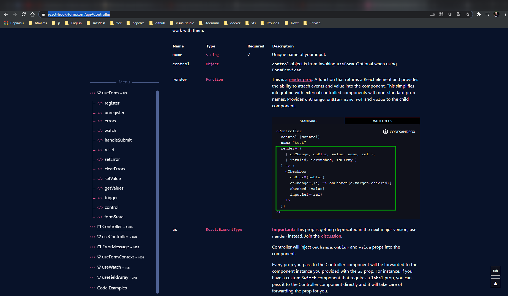

Функция которая покажет что внутри этого контроллера нужно отрендерить. Эта функция получит **onChange** **event** который можно передать элементу **onBlur** т.е. когда он будет вне фокуса, выйдет из фокуса, значение **value** и имя **name** поля. Все это пробрасывается в нужный вам элемент и он получается этот контроллер им управляет.

Нам это потребуется потому что **dropzone** как раз один из таких элементов. Ref туда так просто не пробросишь и придется его обрабатывать в ручную используя контроллер.

По-этому наш компонент **FileInput** будет получать переменную **control**

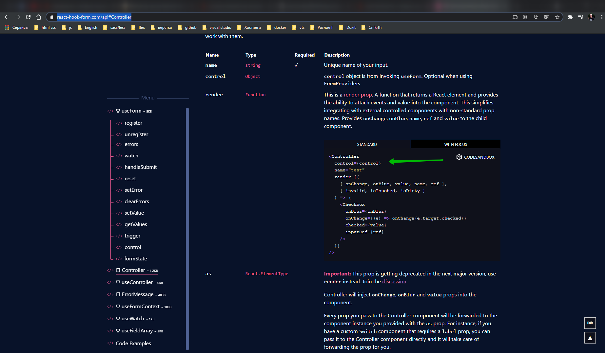

как видите это одна из обязательных переменных которую нужно получать из **react-hook-form**. И name нашего **file-input** на всякий случай, в друг их будет несколько. Я имею ввиду внутри формы.

Теперь в **Controller** передаю атрибут **control={control}** из пропов. **name={name}**. **defaultValue={[]}** по умолчанию это будет пустой массив. Здесь мы будем хранить массив загружаемых файлов. И в качестве функции **render={}** мы передадим следующее. Это будет стрелочная функция возвращающая какой-то **layout**. Внутри данная функция получает какой-то **{onChange, onBlur, value}**

```jsx
//component/FileInput.js
import React from 'react';
import { Controller } from 'react-hook-form';

export const FileInput = ({ control, name }) => {
  return (
    <Controller
      control={control}
      name={name}
      defaultValue={[]}
      render={({ onChange, onBlur, value }) => ()}
    />
  );
};

```

Внутри этой функции возвращаю **Fragment** т.е. \<></>. Внутри во-первых нам нужен будет \<Dropzone>. А во-вторых нам нужно будет отрендерить список файлов т.е. **\<List>**.

```jsx
//component/FileInput.js
import { List } from '@material-ui/core';
import React from 'react';
import Dropzone from 'react-dropzone';
import { Controller } from 'react-hook-form';

export const FileInput = ({ control, name }) => {
  return (
    <Controller
      control={control}
      name={name}
      defaultValue={[]}
      render={({ onChange, onBlur, value }) => (
        <>
          <Dropzone></Dropzone>
          <List />
        </>
      )}
    />
  );
};
```

В **Dropzone** передаю атрибут **onDrop**, т.е. от обрабатывает перетаскивание на него файлов. И мы как раз его будем обрабатывать **onChange** **event** из **Controller**. Делегируем **onDrop** в react-hook-form т.е. он у нас будет теперь отвечать за изменение значения этого поля.

```jsx
//component/FileInput.js
import { List } from '@material-ui/core';
import React from 'react';
import Dropzone from 'react-dropzone';
import { Controller } from 'react-hook-form';

export const FileInput = ({ control, name }) => {
  return (
    <Controller
      control={control}
      name={name}
      defaultValue={[]}
      render={({ onChange, onBlur, value }) => (
        <>
          <Dropzone onDrop={onChange}></Dropzone>
          <List />
        </>
      )}
    />
  );
};
```

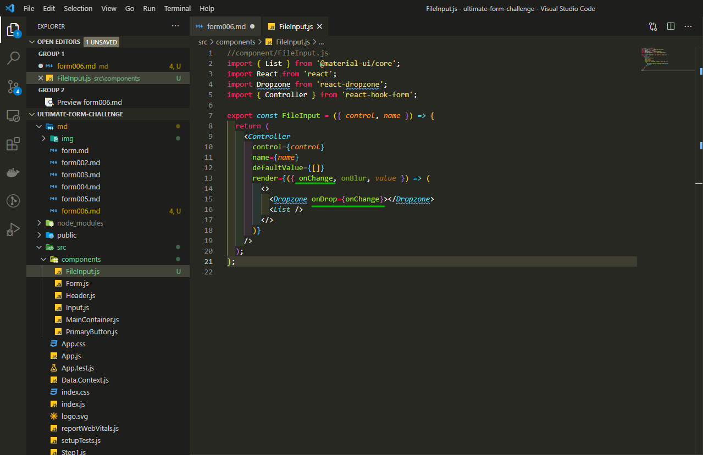

И **Dropzone** на самом деле тоже использует **render-prop-pattern** т.е. **{}**. В него передаем функцию **() =>()**. Она будет рендерить **\<Papper></Papper>** это специальный элемент карточки,бумаги, из **Material-ui**.

```jsx
//component/FileInput.js
import { List, Paper } from '@material-ui/core';
import React from 'react';
import Dropzone from 'react-dropzone';
import { Controller } from 'react-hook-form';

export const FileInput = ({ control, name }) => {
  return (
    <Controller
      control={control}
      name={name}
      defaultValue={[]}
      render={({ onChange, onBlur, value }) => (
        <>
          <Dropzone onDrop={onChange}>{() => <Paper></Paper>}</Dropzone>
          <List />
        </>
      )}
    />
  );
};
```

Функция будет получать в параметры **getRootProps** и **getInputProps**. Это **getRootProps** и **getInputProps** специальные две функции которые позволяют пропы получить для самого **input**, их нужн передать файловому **input** который мы оборачиваем, а **getRootProps** это тому элементу который должен реагировать, который изображает из себя зону куда можно сбрасывать файлы. Поэтому в **Paper** так как это корневой элемент закидываем **spreed** из **...getRootProps()**. Вызываем функцию, она возвращает пропы, мы их раскидываем по пропам **paper**.

Далее для визуального элемента указываю **variant="outlinet"** т.е. нам нужна бумага **Paper** - это визуальный элемент карточки с очерчеными границами.

```jsx
//component/FileInput.js
import { List, Paper } from '@material-ui/core';
import React from 'react';
import Dropzone from 'react-dropzone';
import { Controller } from 'react-hook-form';

export const FileInput = ({ control, name }) => {
  return (
    <Controller
      control={control}
      name={name}
      defaultValue={[]}
      render={({ onChange, onBlur, value }) => (
        <>
          <Dropzone onDrop={onChange}>
            {({ getRootProps, getInputProps }) => (
              <Paper variant="outlined" {...getRootProps()}></Paper>
            )}
          </Dropzone>
          <List />
        </>
      )}
    />
  );
};
```

Внутри мы рендерим **input** c атрибутом **name={name}**, здесь мы передаем name из параметров **fileInput**. Мы пробрасываем его аж до актуального **html** элемента **input**.


Далее в **input** пробрасываю **onBlur={onBlur}** это тот которым управляет контроллер, что бы **raect-hook-form** знала когда фокус с этого файлового **input** снимется.

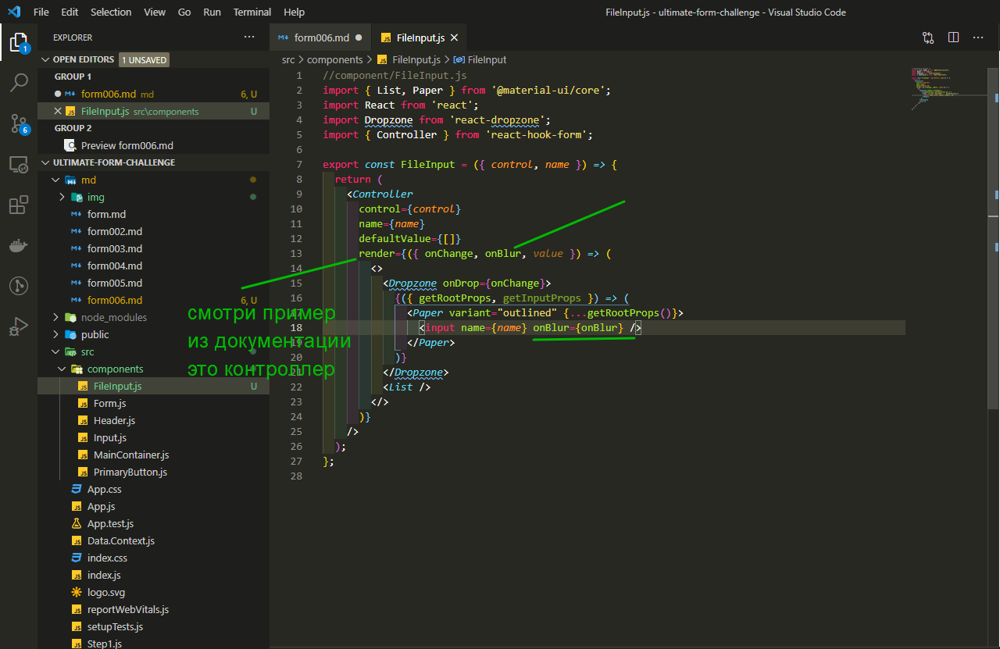

И так же в **input** закидываем атрибут **{...getInputProps()}** т.е. результат выполенения точнее результат выполнения.

```jsx
//component/FileInput.js
import { List, Paper } from '@material-ui/core';
import React from 'react';
import Dropzone from 'react-dropzone';
import { Controller } from 'react-hook-form';

export const FileInput = ({ control, name }) => {
  return (
    <Controller
      control={control}
      name={name}
      defaultValue={[]}
      render={({ onChange, onBlur, value }) => (
        <>
          <Dropzone onDrop={onChange}>
            {({ getRootProps, getInputProps }) => (
              <Paper variant="outlined" {...getRootProps()}>
                <input {...getInputProps()} name={name} onBlur={onBlur} />
              </Paper>
            )}
          </Dropzone>
          <List />
        </>
      )}
    />
  );
};
```

После **input** нам нужно добавить параграф который подскажет пользователю как загружать файлы **\<p>Drag 'n' drop files here, or click to select files</p>** и добавим иконку **\<CloudUpload>**.

```jsx
//component/FileInput.js
import { List, Paper } from '@material-ui/core';
import { CloudUpload } from '@material-ui/icons';
import React from 'react';
import Dropzone from 'react-dropzone';
import { Controller } from 'react-hook-form';

export const FileInput = ({ control, name }) => {
  return (
    <Controller
      control={control}
      name={name}
      defaultValue={[]}
      render={({ onChange, onBlur, value }) => (
        <>
          <Dropzone onDrop={onChange}>
            {({ getRootProps, getInputProps }) => (
              <Paper variant="outlined" {...getRootProps()}>
                <CloudUpload />
                <input {...getInputProps()} name={name} onBlur={onBlur} />
                <p>Drag 'n' drop files here, or click to select files</p>
              </Paper>
            )}
          </Dropzone>
          <List />
        </>
      )}
    />
  );
};
```

Теперь мы можем занятся отображением списка.

Здесь нам потребуется отображаения поля **value**. Так как мы все еще это все рендерим внутри **Controller**. Внутри **List** добавляю **{}** b прописываю **loop** т.е. цикл **value.map((f, index) =>{})** т.е. по порядку каким этот файл идет.

```jsx
//component/FileInput.js
import { List, Paper } from '@material-ui/core';
import { CloudUpload } from '@material-ui/icons';
import React from 'react';
import Dropzone from 'react-dropzone';
import { Controller } from 'react-hook-form';

export const FileInput = ({ control, name }) => {
  return (
    <Controller
      control={control}
      name={name}
      defaultValue={[]}
      render={({ onChange, onBlur, value }) => (
        <>
          <Dropzone onDrop={onChange}>
            {({ getRootProps, getInputProps }) => (
              <Paper variant="outlined" {...getRootProps()}>
                <CloudUpload />
                <input {...getInputProps()} name={name} onBlur={onBlur} />
                <p>Drag 'n' drop files here, or click to select files</p>
              </Paper>
            )}
          </Dropzone>
          <List>
            {
              value.map((f, index) =>(

              ))
            }
          </List>
        </>
      )}
    />
  );
};

```

Далее я добавляю **\<ListItem>** в его атрибутах передаю **key =>{index}**. Т.к. это внешний элемент в цикле ему обязательно иметь уникальный ключ. Добавляю иконку **\<ListItemIcon></ListItemIcon>** оборачиваю иконку, а сама иконка будет **\<InsertDriveFile />** .

```jsx
//component/FileInput.js
import { List, ListItemIcon, Paper } from '@material-ui/core';
import { CloudUpload, InsertDriveFile } from '@material-ui/icons';
import React from 'react';
import Dropzone from 'react-dropzone';
import { Controller } from 'react-hook-form';

export const FileInput = ({ control, name }) => {
  return (
    <Controller
      control={control}
      name={name}
      defaultValue={[]}
      render={({ onChange, onBlur, value }) => (
        <>
          <Dropzone onDrop={onChange}>
            {({ getRootProps, getInputProps }) => (
              <Paper variant="outlined" {...getRootProps()}>
                <CloudUpload />
                <input {...getInputProps()} name={name} onBlur={onBlur} />
                <p>Drag 'n' drop files here, or click to select files</p>
              </Paper>
            )}
          </Dropzone>
          <List>
            {value.map((f, index) => (
              <List key={index}>
                <ListItemIcon>
                  <InsertDriveFile />
                </ListItemIcon>
              </List>
            ))}
          </List>
        </>
      )}
    />
  );
};
```

Кроме иконки нам нужно отобразить текст с названием файла. Это мы делаем при помощи элемента **\<ListItemText pramary={f.name} secondary={f.size}/>**

```jsx
//component/FileInput.js
import { List, ListItemIcon, ListItemText, Paper } from '@material-ui/core';
import { CloudUpload, InsertDriveFile } from '@material-ui/icons';
import React from 'react';
import Dropzone from 'react-dropzone';
import { Controller } from 'react-hook-form';

export const FileInput = ({ control, name }) => {
  return (
    <Controller
      control={control}
      name={name}
      defaultValue={[]}
      render={({ onChange, onBlur, value }) => (
        <>
          <Dropzone onDrop={onChange}>
            {({ getRootProps, getInputProps }) => (
              <Paper variant="outlined" {...getRootProps()}>
                <CloudUpload />
                <input {...getInputProps()} name={name} onBlur={onBlur} />
                <p>Drag 'n' drop files here, or click to select files</p>
              </Paper>
            )}
          </Dropzone>
          <List>
            {value.map((f, index) => (
              <List key={index}>
                <ListItemIcon>
                  <InsertDriveFile />
                </ListItemIcon>
                <ListItemText primary={f.name} secondary={f.size} />
              </List>
            ))}
          </List>
        </>
      )}
    />
  );
};
```

Теперь мы можем проверить как у нас это все рабртает.

В **App.js** нам нужно объявить **Step3**. Для этого создаю новый файл **Step3.js** И так это быстрый шаблон

```jsx
// Step3.js
import { Typography } from '@material-ui/core';
import React from 'react';

import { MainContainer } from './components/MainContainer';
import { Form } from './components/Form';
import { FileInput } from './components/FileInput';

export const Step3 = () => {
  return (
    <MainContainer>
      <Typography component="h2" variant="h5">
        Step3
      </Typography>
      <Form>
        <FileInput name="files" />
      </Form>
    </MainContainer>
  );
};
```

Для того что бы в **FileInput** пробросить **control**. Для того что бы его передать нам нужно объявить **react-hook-form** т.е. так как мы делали раньше **const{control,}**. Параметр **register** нам тут не потребуется т.к. у нас нет полей которые его бы потдерживали. По этотму получает **const {control, handlerSubmit} = useForm()**.

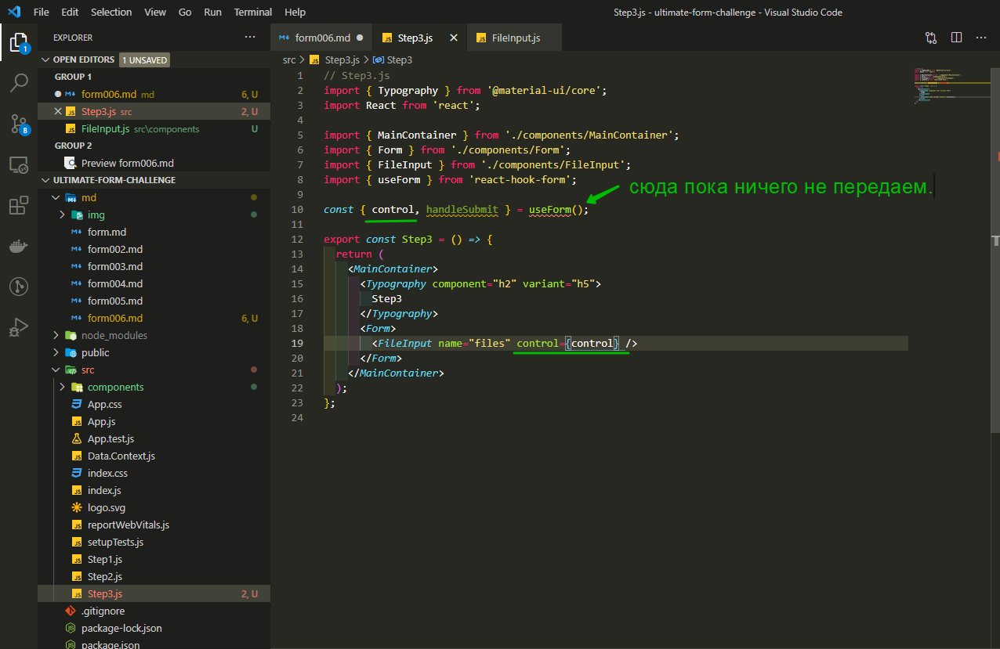

```jsx
// Step3.js
import { Typography } from '@material-ui/core';
import React from 'react';
import { useForm } from 'react-hook-form';

import { MainContainer } from './components/MainContainer';
import { Form } from './components/Form';
import { FileInput } from './components/FileInput';

export const Step3 = () => {
  const { control, handleSubmit } = useForm();
  return (
    <MainContainer>
      <Typography component="h2" variant="h5">
        Step3
      </Typography>
      <Form>
        <FileInput name="files" control={control} />
      </Form>
    </MainContainer>
  );
};
```

Далее

```jsx
import React from 'react';
import { BrowserRouter as Router, Route, Switch } from 'react-router-dom';

import { Header } from './components/Header';
import { Step1 } from './Step1';
import { Step2 } from './Step2';
import { Step3 } from './Step3';

const Result = () => <>result</>;

function App() {
  return (
    <>
      <Header />
      <Router>
        <Switch>
          <Route exact path="/" component={Step1} />
          <Route path="/step2" component={Step2} />
          <Route path="/step3" component={Step3} />
          <Route path="/result" component={Result} />
        </Switch>
      </Router>
    </>
  );
}

export default App;
```

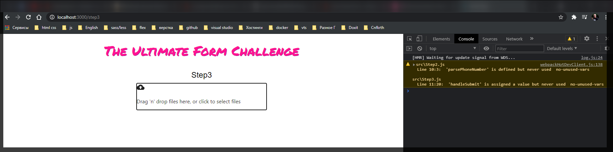

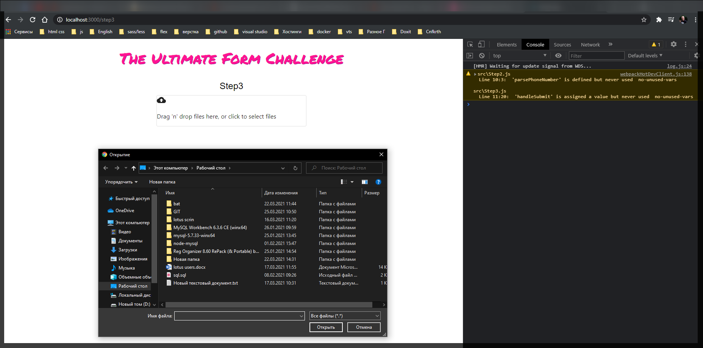

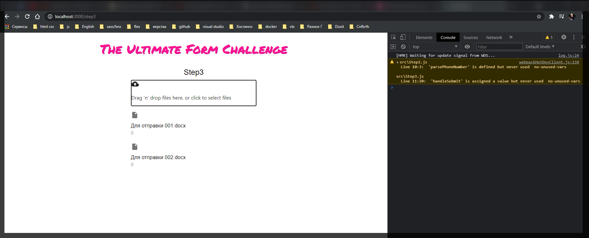

Теперь стилизация. В **FileInput.js** прописываю **const useStyles = makeStyles((theme) =>({}))**. Здесь нам нужно объявить два элемента, **root** - это само поле **dropzone**, и поле **icon**.

```jsx
//component/FileInput.js
import {
  List,
  ListItemIcon,
  ListItemText,
  makeStyles,
  Paper,
} from '@material-ui/core';
import { CloudUpload, InsertDriveFile } from '@material-ui/icons';
import React from 'react';
import Dropzone from 'react-dropzone';
import { Controller } from 'react-hook-form';

const useStyles = makeStyles((theme) => ({
  root: {
    backgroundColor: '#eee',
    textAlign: 'center',
    cursor: 'pointer',
    color: '#333',
    padding: '10px',
    marginTop: '20px',
  },
  icon: {
    marginTop: '16px',
    color: '#888',
    fontSize: '42px',
  },
}));

export const FileInput = ({ control, name }) => {
  return (
    <Controller
      control={control}
      name={name}
      defaultValue={[]}
      render={({ onChange, onBlur, value }) => (
        <>
          <Dropzone onDrop={onChange}>
            {({ getRootProps, getInputProps }) => (
              <Paper variant="outlined" {...getRootProps()}>
                <CloudUpload />
                <input {...getInputProps()} name={name} onBlur={onBlur} />
                <p>Drag 'n' drop files here, or click to select files</p>
              </Paper>
            )}
          </Dropzone>
          <List>
            {value.map((f, index) => (
              <List key={index}>
                <ListItemIcon>
                  <InsertDriveFile />
                </ListItemIcon>
                <ListItemText primary={f.name} secondary={f.size} />
              </List>
            ))}
          </List>
        </>
      )}
    />
  );
};
```

Теперь в самом **FileInput** я получаю стили **const styles = useStyles()**. Визуальный элемент у нас это **Paper**. Dropzone это именно логический элемент. Он обрабатывает **Drag 'n' drop** и свои **event** например **onDrop** т.е. когда файл в него падает, он пробрасыват как бы контройлеру т.е. когда произойдет **onDrop**, он вызовет **onChange** у **Controller** и форма узнает что происходит.

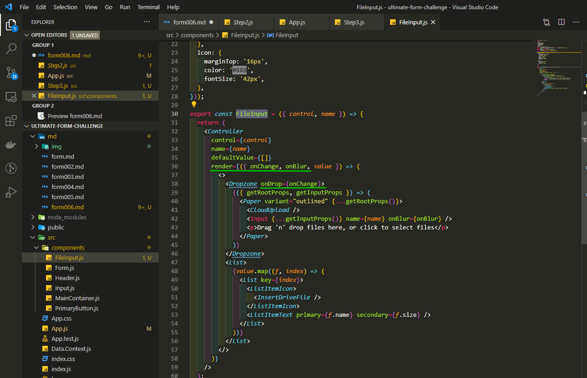

Внешний вид добавляется при помощи компонента **Paper** из **material-ui**. По этому в **Paper** передаю **className={styles.root}**. И иконке **CloudUpload** добавлю **className={styles.icon}**

```jsx
//component/FileInput.js
import {
  List,
  ListItemIcon,
  ListItemText,
  makeStyles,
  Paper,
} from '@material-ui/core';
import { CloudUpload, InsertDriveFile } from '@material-ui/icons';
import React from 'react';
import Dropzone from 'react-dropzone';
import { Controller } from 'react-hook-form';

const useStyles = makeStyles((theme) => ({
  root: {
    backgroundColor: '#eee',
    textAlign: 'center',
    cursor: 'pointer',
    color: '#333',
    padding: '10px',
    marginTop: '20px',
  },
  icon: {
    marginTop: '16px',
    color: '#888',
    fontSize: '42px',
  },
}));

export const FileInput = ({ control, name }) => {
  const styles = useStyles();

  return (
    <Controller
      control={control}
      name={name}
      defaultValue={[]}
      render={({ onChange, onBlur, value }) => (
        <>
          <Dropzone onDrop={onChange}>
            {({ getRootProps, getInputProps }) => (
              <Paper
                className={styles.root}
                variant="outlined"
                {...getRootProps()}
              >
                <CloudUpload className={styles.icon} />
                <input {...getInputProps()} name={name} onBlur={onBlur} />
                <p>Drag 'n' drop files here, or click to select files</p>
              </Paper>
            )}
          </Dropzone>
          <List>
            {value.map((f, index) => (
              <List key={index}>
                <ListItemIcon>
                  <InsertDriveFile />
                </ListItemIcon>
                <ListItemText primary={f.name} secondary={f.size} />
              </List>
            ))}
          </List>
        </>
      )}
    />
  );
};
```

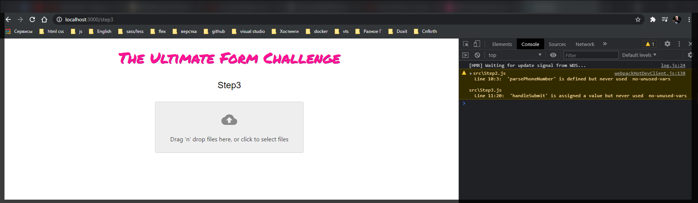

Теперь добавляю кнопку которая будет вести на страницу результатов. В **Step3.js** под **FileInput** добавляю **PrimatyButton**. В **Form** передаю **onSubmit={handleSubmit(onSubmit)}**

```jsx
// Step3.js
import { Typography } from '@material-ui/core';
import React from 'react';
import { useForm } from 'react-hook-form';

import { MainContainer } from './components/MainContainer';
import { Form } from './components/Form';
import { FileInput } from './components/FileInput';
import { PrimaryButton } from './components/PrimaryButton';

export const Step3 = () => {
  const { control, handleSubmit } = useForm();
  return (
    <MainContainer>
      <Typography component="h2" variant="h5">
        Step3
      </Typography>
      <Form onSubmit={handleSubmit(onSubmit)}>
        <FileInput name="files" control={control} />
        <PrimaryButton>Next</PrimaryButton>
      </Form>
    </MainContainer>
  );
};
```

Теперь объявим саму функцию **onSubmit**

```jsx
// Step3.js
import { Typography } from '@material-ui/core';
import React from 'react';
import { useForm } from 'react-hook-form';

import { MainContainer } from './components/MainContainer';
import { Form } from './components/Form';
import { FileInput } from './components/FileInput';
import { PrimaryButton } from './components/PrimaryButton';
import { useHistory } from 'react-router';

export const Step3 = () => {
  const history = useHistory();
  const { control, handleSubmit } = useForm();

  const onSubmit = (data) => {
    history.push('./result');
  };
  return (
    <MainContainer>
      <Typography component="h2" variant="h5">
        Step3
      </Typography>
      <Form onSubmit={handleSubmit(onSubmit)}>
        <FileInput name="files" control={control} />
        <PrimaryButton>Next</PrimaryButton>
      </Form>
    </MainContainer>
  );
};
```

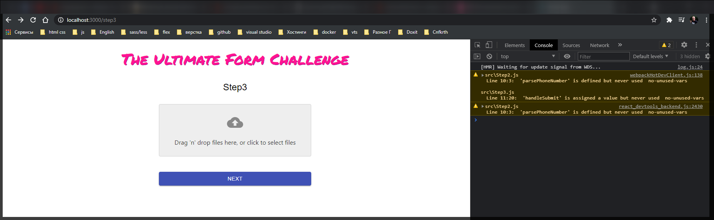
