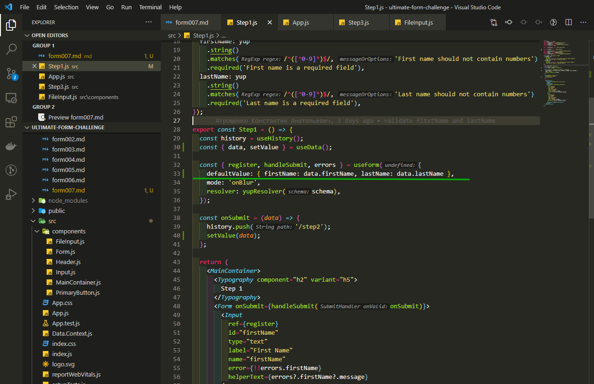
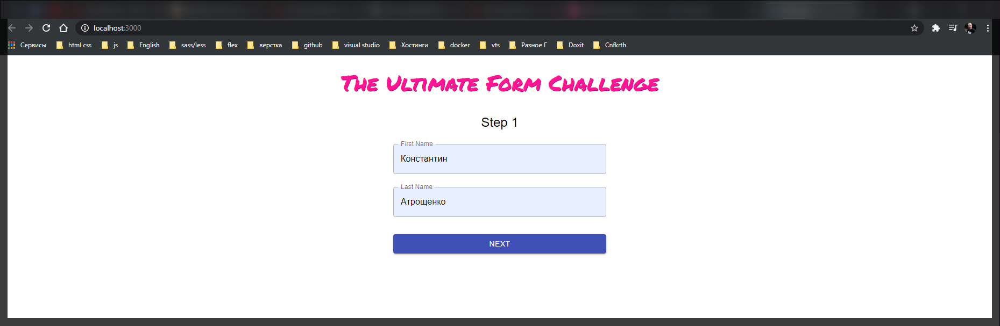
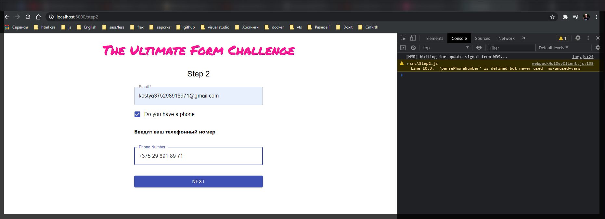
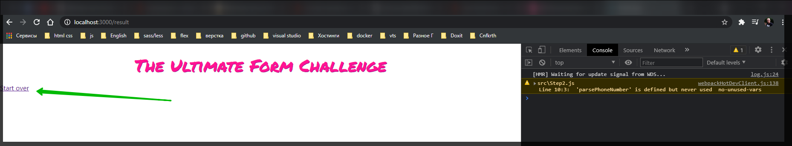
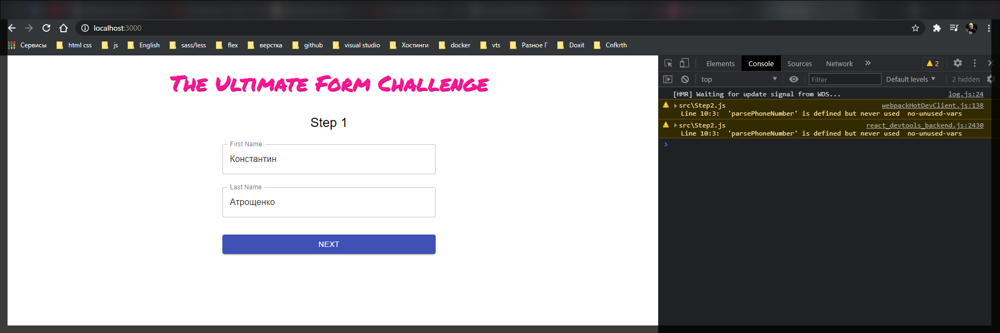
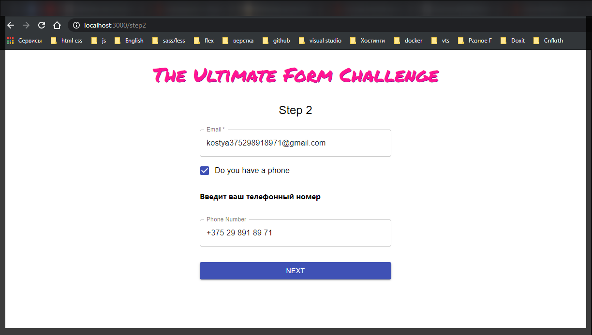
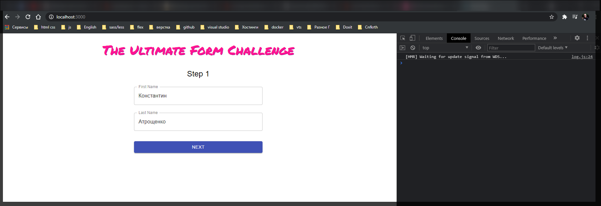
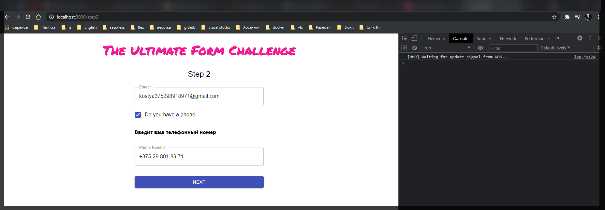
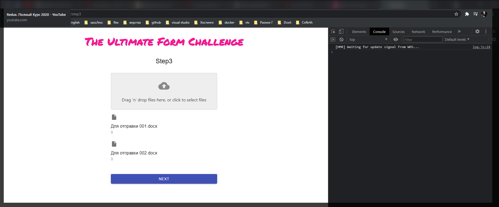

# Страница вывода результатов.

Проблема страницы с результатами заключается в том что нам их нужно как-то сохранять в контексте.

Мы уже создали **DataContext.js**

```jsx
// Data.Context.js

import React, { createContext, useContext, useState } from 'react';

const DataContext = createContext();

export const DataProvider = ({ children }) => {
  const [data, setData] = useState({});

  const setValues = (values) => {
    setData((prevData) => ({
      ...prevData,
      ...values,
    }));
  };

  return (
    <DataContext.Provider value={{ data, setValues }}>
      {children}
    </DataContext.Provider>
  );
};

export const useData = () => useContext(DataContext);
```

Его мы можем получать через **useData**.

Сейчас пройдемся по компонентам и добавим сохранение данных в **state**.

Начну со **State1.js**.

Здесь в **onSubmit** мы получаем **data** из формы. Причем получаем их если только форма валидна. Если произошли какие-то ошибки в данных мы ни какие данные не получим, она засабмитчена не будет. Добавляю хук **const {data, setValues} = useData()**.

Далее в функции **onSubmit** я использую **setValues(data)** для того что бы передать туда данные.

```jsx
//Step1.js
import React from 'react';
import { Typography } from '@material-ui/core';
import { useForm } from 'react-hook-form';
import { yupResolver } from '@hookform/resolvers/yup';
import * as yup from 'yup';

import { useHistory } from 'react-router-dom';

import { useData } from './Data.Context';

import { MainContainer } from './components/MainContainer';
import { Form } from './components/Form';
import { Input } from './components/Input';
import { PrimaryButton } from './components/PrimaryButton';

const schema = yup.object().shape({
  firstName: yup
    .string()
    .matches(/^([^0-9]*)$/, 'First name should not contain numbers')
    .required('First name is a required field'),
  lastName: yup
    .string()
    .matches(/^([^0-9]*)$/, 'Last name should not contain numbers')
    .required('Last name is a required field'),
});

export const Step1 = () => {
  const history = useHistory();
  const { data, setValues } = useData();

  const { register, handleSubmit, errors } = useForm({
    mode: 'onBlur',
    resolver: yupResolver(schema),
  });

  const onSubmit = (data) => {
    history.push('/step2');
    setValues(data);
  };

  return (
    <MainContainer>
      <Typography component="h2" variant="h5">
        Step 1
      </Typography>
      <Form onSubmit={handleSubmit(onSubmit)}>
        <Input
          ref={register}
          id="firstName"
          type="text"
          label="First Name"
          name="firstName"
          error={!!errors.firstName}
          helperText={errors?.firstName?.message}
        />
        <Input
          ref={register}
          id="lastName"
          type="text"
          label="Last Name"
          name="lastName"
          error={!!errors.lastName}
          helperText={errors?.lastName?.message}
        />
        <PrimaryButton>Next</PrimaryButton>
      </Form>
    </MainContainer>
  );
};
```

А еще так как мы имеем доступ к данным которые храняться в нашем контексте мы можем использовать их как **default**. Для этого я при инициализации формы передаю **defaultValues: {firstName: data.firstName, lastName: data.last.name}**



```jsx
//Step1.js
import React from 'react';
import { Typography } from '@material-ui/core';
import { useForm } from 'react-hook-form';
import { yupResolver } from '@hookform/resolvers/yup';
import * as yup from 'yup';

import { useHistory } from 'react-router-dom';

import { useData } from './Data.Context';

import { MainContainer } from './components/MainContainer';
import { Form } from './components/Form';
import { Input } from './components/Input';
import { PrimaryButton } from './components/PrimaryButton';

const schema = yup.object().shape({
  firstName: yup
    .string()
    .matches(/^([^0-9]*)$/, 'First name should not contain numbers')
    .required('First name is a required field'),
  lastName: yup
    .string()
    .matches(/^([^0-9]*)$/, 'Last name should not contain numbers')
    .required('Last name is a required field'),
});

export const Step1 = () => {
  const history = useHistory();
  const { data, setValues } = useData();

  const { register, handleSubmit, errors } = useForm({
    defaultValues: { firstName: data.firstName, lastName: data.lastName },
    mode: 'onBlur',
    resolver: yupResolver(schema),
  });

  const onSubmit = (data) => {
    history.push('/step2');
    setValues(data);
  };

  return (
    <MainContainer>
      <Typography component="h2" variant="h5">
        Step 1
      </Typography>
      <Form onSubmit={handleSubmit(onSubmit)}>
        <Input
          ref={register}
          id="firstName"
          type="text"
          label="First Name"
          name="firstName"
          error={!!errors.firstName}
          helperText={errors?.firstName?.message}
        />
        <Input
          ref={register}
          id="lastName"
          type="text"
          label="Last Name"
          name="lastName"
          error={!!errors.lastName}
          helperText={errors?.lastName?.message}
        />
        <PrimaryButton>Next</PrimaryButton>
      </Form>
    </MainContainer>
  );
};
```

Теперь для того что бы проверить что у нас эта часть работает мы идем в **App.js** и в **const Result = () => <>result</>;** добавим **\<Link to="/">Start over</Link>**

```jsx
import React from 'react';
import { BrowserRouter as Router, Link, Route, Switch } from 'react-router-dom';

import { Header } from './components/Header';
import { Step1 } from './Step1';
import { Step2 } from './Step2';
import { Step3 } from './Step3';

const Result = () => (
  <>
    <Link to="/">Start over</Link>
  </>
);

function App() {
  return (
    <>
      <Header />
      <Router>
        <Switch>
          <Route exact path="/" component={Step1} />
          <Route path="/step2" component={Step2} />
          <Route path="/step3" component={Step3} />
          <Route path="/result" component={Result} />
        </Switch>
      </Router>
    </>
  );
}

export default App;
```

Т.е. страница **result** у нас все еще фейковая и там только одна ссылка для того что бы начать сначало, но мы знаем что на первом шаге мы уже сохраняем данные.










И вот у меня есть сохраненные данные.

Теперь давайте сделаем так что бы данные на втором и третьем шаге тоже сохранялись.

В **Step2.js** делшаем тоже самое.

```jsx
//Step2.js
import React from 'react';
import { Checkbox, FormControlLabel, Typography } from '@material-ui/core';

import { MainContainer } from './components/MainContainer';
import { useForm } from 'react-hook-form';
import { useHistory } from 'react-router-dom';
import * as yup from 'yup';
import { parsePhoneNumberFromString } from 'libphonenumber-js';

import { Form } from './components/Form';
import { Input } from './components/Input';
import { PrimaryButton } from './components/PrimaryButton';
import { yupResolver } from '@hookform/resolvers/yup';
import { useData } from './Data.Context';

const schema = yup.object().shape({
  email: yup
    .string()
    .email('Email should have  correct format')
    .required('Email is a required field'),
});

export const Step2 = () => {
  const history = useHistory();
  const { data, setValues } = useData();

  const { register, handleSubmit, watch, errors } = useForm({
    defaultValues: {
      email: data.email,
      hasPhone: data.hasPhone,
      phoneNumber: data.phoneNumber,
    },
    mode: 'onBlur',
    resolver: yupResolver(schema),
  });

  const hasPhone = watch('hasPhone');

  const onSubmit = (data) => {
    history.push('/step3');
    setValues(data);
  };

  const normalizePhoneNumber = (value) => {
    const phoneNumber = parsePhoneNumberFromString(value);
    if (!phoneNumber) {
      return value;
    }
    return phoneNumber.formatInternational();
  };

  return (
    <MainContainer>
      <Typography component="h2" variant="h5">
        Step 2
      </Typography>
      <Form onSubmit={handleSubmit(onSubmit)}>
        <Input
          ref={register}
          id="email"
          type="email"
          label="Email"
          name="email"
          required
          error={!!errors.email}
          helperText={errors?.email?.message}
        />

        <FormControlLabel
          control={
            <Checkbox name="hasPhone" inputRef={register} color="primary" />
          }
          label="Do you have a phone"
        />
        {hasPhone && (
          <>
            <h4>Введит ваш телефонный номер</h4>
            <Input
              ref={register}
              id="phoneNumber"
              type="tel"
              label="Phone Number"
              name="phoneNumber"
              onChange={(event) => {
                event.target.value = normalizePhoneNumber(event.target.value);
              }}
            />
          </>
        )}

        <PrimaryButton>Next</PrimaryButton>
      </Form>
    </MainContainer>
  );
};
```

На самом деле для того что бы **checkbox** у нас правильно отрабатывал ему нужно задать **default**.

Указываю **\<Checkbox defaultValue={data.hasPhone} defaultChecked={data.hasPhone} name="hasPhone"
inputRef={register} color="primary"/>**.

```jsx
//Step2.js
import React from 'react';
import { Checkbox, FormControlLabel, Typography } from '@material-ui/core';

import { MainContainer } from './components/MainContainer';
import { useForm } from 'react-hook-form';
import { useHistory } from 'react-router-dom';
import * as yup from 'yup';
import { parsePhoneNumberFromString } from 'libphonenumber-js';

import { Form } from './components/Form';
import { Input } from './components/Input';
import { PrimaryButton } from './components/PrimaryButton';
import { yupResolver } from '@hookform/resolvers/yup';
import { useData } from './Data.Context';

const schema = yup.object().shape({
  email: yup
    .string()
    .email('Email should have  correct format')
    .required('Email is a required field'),
});

export const Step2 = () => {
  const history = useHistory();
  const { data, setValues } = useData();

  const { register, handleSubmit, watch, errors } = useForm({
    defaultValues: {
      email: data.email,
      hasPhone: data.hasPhone,
      phoneNumber: data.phoneNumber,
    },
    mode: 'onBlur',
    resolver: yupResolver(schema),
  });

  const hasPhone = watch('hasPhone');

  const onSubmit = (data) => {
    history.push('/step3');
    setValues(data);
  };

  const normalizePhoneNumber = (value) => {
    const phoneNumber = parsePhoneNumberFromString(value);
    if (!phoneNumber) {
      return value;
    }
    return phoneNumber.formatInternational();
  };

  return (
    <MainContainer>
      <Typography component="h2" variant="h5">
        Step 2
      </Typography>
      <Form onSubmit={handleSubmit(onSubmit)}>
        <Input
          ref={register}
          id="email"
          type="email"
          label="Email"
          name="email"
          required
          error={!!errors.email}
          helperText={errors?.email?.message}
        />

        <FormControlLabel
          control={
            <Checkbox
              defaultValue={data.hasPhone}
              defaultChecked={data.hasPhone}
              name="hasPhone"
              inputRef={register}
              color="primary"
            />
          }
          label="Do you have a phone"
        />
        {hasPhone && (
          <>
            <h4>Введит ваш телефонный номер</h4>
            <Input
              ref={register}
              id="phoneNumber"
              type="tel"
              label="Phone Number"
              name="phoneNumber"
              onChange={(event) => {
                event.target.value = normalizePhoneNumber(event.target.value);
              }}
            />
          </>
        )}

        <PrimaryButton>Next</PrimaryButton>
      </Form>
    </MainContainer>
  );
};
```



Теперь и на втором шаге данные сохраняются.

Перехожу в **Step3.js**. И все по старой схеме.

```jsx
// Step3.js
import { Typography } from '@material-ui/core';
import React from 'react';
import { useForm } from 'react-hook-form';

import { useData } from './Data.Context';

import { MainContainer } from './components/MainContainer';
import { Form } from './components/Form';
import { FileInput } from './components/FileInput';
import { PrimaryButton } from './components/PrimaryButton';
import { useHistory } from 'react-router';

export const Step3 = () => {
  const history = useHistory();
  const { data, setValues } = useData();
  const { control, handleSubmit } = useForm({
    defaultValues: { files: data.files },
  });

  const onSubmit = (data) => {
    history.push('./result');
    setValues(data);
  };
  return (
    <MainContainer>
      <Typography component="h2" variant="h5">
        Step3
      </Typography>
      <Form onSubmit={handleSubmit(onSubmit)}>
        <FileInput name="files" control={control} />
        <PrimaryButton>Next</PrimaryButton>
      </Form>
    </MainContainer>
  );
};
```







И вот на каждом шаге все данные сохраняются.
