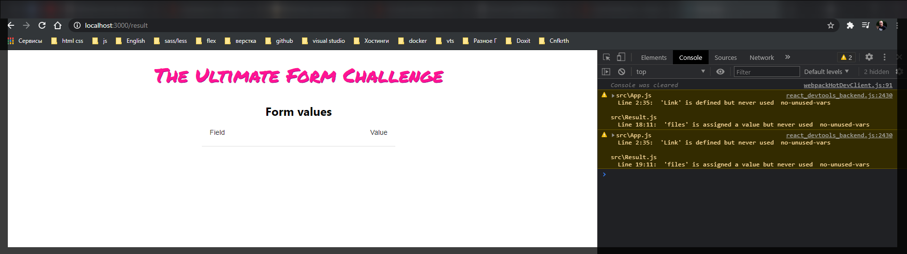
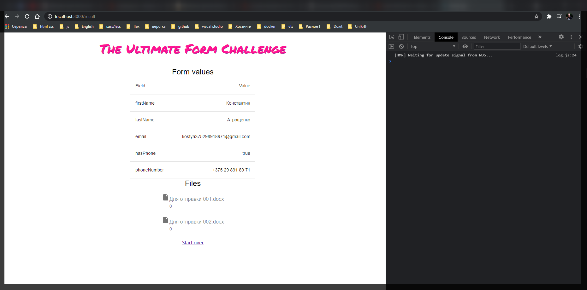

Теперь можем начать рисовать это все рисовать на начальном экране и готовится к отправке данных на сервер.

Для этого нам нужно создать специальный компонент **Result.js**

```jsx
import React from 'react';
import { MainContainer } from './MainContainer';

export const Result = () => {
  return <MainContainer></MainContainer>;
};
```

Как обычно оборачиваю все в MainContainer

```jsx
import { Typography } from '@material-ui/core';
import React from 'react';
import { MainContainer } from './MainContainer';

export const Result = () => {
  return (
    <MainContainer>
      <Typography component="h2" variant="5">
        Form values
      </Typography>
    </MainContainer>
  );
};
```

Здесь сейчас мы будетм отображать данные которые мы храним в контексте.

Для этого нам нужно сначало эти данные получить **const {data} = useDate()**

```jsx
import React from 'react';
import { Typography } from '@material-ui/core';
import { MainContainer } from './MainContainer';
import { useData } from '../Data.Context';

export const Result = () => {
  const { data } = useData();

  return (
    <MainContainer>
      <Typography component="h2" variant="5">
        Form values
      </Typography>
    </MainContainer>
  );
};
```

теперь указываю **\<TableContainer></TableContainer>** в атрибутах указываю какой компонент использовать **component={Paper}**. Внутри объявляю **\<Table></Table>**. Внутри таблицы будет заголовок **\<TableHead><TableHead>** и тело таблицы.

```jsx
import React from 'react';
import { Paper, TableContainer, Typography } from '@material-ui/core';
import { MainContainer } from './MainContainer';
import { useData } from '../Data.Context';

export const Result = () => {
  const { data } = useData();

  return (
    <MainContainer>
      <Typography component="h2" variant="5">
        Form values
      </Typography>
      <TableContainer container={Paper}>
        <Table>
          <TableHead></TableHead>
          <TableBody></TableBody>
        </Table>
      </TableContainer>
    </MainContainer>
  );
};
```

В заголовок нужно добавить **\<TableRow></TableRow>** и в этот ряд нужно добавить две ячейки в которых будет написано **field** т.е. название поля и **value** ее значение. Т.е. в **\<TableRow></TableRow>** я добавляю **\<TableCell></TableCell>**

```jsx
import React from 'react';
import {
  Table,
  TableHead,
  TableBody,
  Paper,
  TableCell,
  TableContainer,
  TableRow,
  Typography,
} from '@material-ui/core';
import { MainContainer } from './MainContainer';
import { useData } from '../Data.Context';

export const Result = () => {
  const { data } = useData();

  return (
    <MainContainer>
      <Typography component="h2" variant="5">
        Form values
      </Typography>
      <TableContainer container={Paper}>
        <Table>
          <TableHead>
            <TableRow>
              <TableCell>Field</TableCell>
              <TableCell>Value align="right"</TableCell>
            </TableRow>
          </TableHead>
          <TableBody></TableBody>
        </Table>
      </TableContainer>
    </MainContainer>
  );
};
```

Для того что бы отрендерить **\<TableBody></TableBody>** т.е. заполнить его полями которые мы заполняли нам нужно отфильтровать обычные поля с обычными данными и файлы.

Для этого я создаю костанту **entries** которая у нас будет хранить значение обычных полей формы.

```jsx
import React from 'react';
import {
  Table,
  TableHead,
  TableBody,
  Paper,
  TableCell,
  TableContainer,
  TableRow,
  Typography,
} from '@material-ui/core';
import { MainContainer } from './MainContainer';
import { useData } from '../Data.Context';

export const Result = () => {
  const { data } = useData();
  const entries = Object.entries(data).filter((entry) => entry[]);

  return (
    <MainContainer>
      <Typography component="h2" variant="5">
        Form values
      </Typography>
      <TableContainer container={Paper}>
        <Table>
          <TableHead>
            <TableRow>
              <TableCell>Field</TableCell>
              <TableCell>Value align="right"</TableCell>
            </TableRow>
          </TableHead>
          <TableBody></TableBody>
        </Table>
      </TableContainer>
    </MainContainer>
  );
};

```

Т.е. **entry[]** Это когда мы разбиваем объект который представляет собой ключ: значение на пары т.е на маленькие массивчики из двух элементов. Т.е. мы смотрим **entry[0]** т.е. ключ который хранится в первом элементе **entry[] !== "files"** тогда все хорошо.

И сразу можем создать константу для файлов **const {files} = data**. Т.е. мы их просто выдергиваем.

```jsx
import React from 'react';
import {
  Table,
  TableHead,
  TableBody,
  Paper,
  TableCell,
  TableContainer,
  TableRow,
  Typography,
} from '@material-ui/core';
import { MainContainer } from './MainContainer';
import { useData } from '../Data.Context';

export const Result = () => {
  const { data } = useData();
  const entries = Object.entries(data).filter((entry) => entry[0] !== 'files');
  const { files } = data;

  return (
    <MainContainer>
      <Typography component="h2" variant="5">
        Form values
      </Typography>
      <TableContainer container={Paper}>
        <Table>
          <TableHead>
            <TableRow>
              <TableCell>Field</TableCell>
              <TableCell>Value align="right"</TableCell>
            </TableRow>
          </TableHead>
          <TableBody></TableBody>
        </Table>
      </TableContainer>
    </MainContainer>
  );
};
```

Теперь мы можем заполнить тело таблицы. **{}** в скобках прохожусь по массиву **entries.map(entry)** и для каждого из этих **entries** мы будем создавать **\<TableRow key={entry[0]}></TableRow>**. Внутри мы будем рендерить две **<TabelCell></TabelCell>** В котором рендерю **{entry[0]}**

```jsx
//Result.js
import React from 'react';
import {
  Table,
  TableHead,
  TableBody,
  Paper,
  TableCell,
  TableContainer,
  TableRow,
  Typography,
} from '@material-ui/core';
import { MainContainer } from './components/MainContainer';
import { useData } from './Data.Context';

export const Result = () => {
  const { data } = useData();
  const entries = Object.entries(data).filter((entry) => entry[0] !== 'files');
  const { files } = data;

  return (
    <MainContainer>
      <Typography component="h2" variant="5">
        Form values
      </Typography>
      <TableContainer container={Paper}>
        <Table>
          <TableHead>
            <TableRow>
              <TableCell>Field</TableCell>
              <TableCell align="right">Value</TableCell>
            </TableRow>
          </TableHead>
          <TableBody>
            {entries.map((entry) => (
              <TableRow key={entry[0]}>
                <TableCell>{entry[0]}</TableCell>
                <TableCell align="right">{entry[1].toString()}</TableCell>
              </TableRow>
            ))}
          </TableBody>
        </Table>
      </TableContainer>
    </MainContainer>
  );
};
```

Выведу

```jsx
import React from 'react';
import { BrowserRouter as Router, Link, Route, Switch } from 'react-router-dom';

import { Header } from './components/Header';
import { Step1 } from './Step1';
import { Step2 } from './Step2';
import { Step3 } from './Step3';
import { Result } from './Result';

function App() {
  return (
    <>
      <Header />
      <Router>
        <Switch>
          <Route exact path="/" component={Step1} />
          <Route path="/step2" component={Step2} />
          <Route path="/step3" component={Step3} />
          <Route path="/result" component={Result} />
        </Switch>
      </Router>
    </>
  );
}

export default App;
```



Только у нас нет ссылки что бы все добавить.

```jsx
//Result.js
import React from 'react';
import {
  Table,
  TableHead,
  TableBody,
  Paper,
  TableCell,
  TableContainer,
  TableRow,
  Typography,
} from '@material-ui/core';
import { Link } from 'react-router-dom';
import { MainContainer } from './components/MainContainer';
import { useData } from './Data.Context';

export const Result = () => {
  const { data } = useData();
  const entries = Object.entries(data).filter((entry) => entry[0] !== 'files');
  const { files } = data;

  return (
    <MainContainer>
      <Typography component="h2" variant="5">
        Form values
      </Typography>
      <TableContainer container={Paper}>
        <Table>
          <TableHead>
            <TableRow>
              <TableCell>Field</TableCell>
              <TableCell align="right">Value</TableCell>
            </TableRow>
          </TableHead>
          <TableBody>
            {entries.map((entry) => (
              <TableRow key={entry[0]}>
                <TableCell>{entry[0]}</TableCell>
                <TableCell align="right">{entry[1].toString()}</TableCell>
              </TableRow>
            ))}
          </TableBody>
        </Table>
      </TableContainer>
      <Link to="/">Start over</Link>
    </MainContainer>
  );
};
```

теперь добавляю проверку по файлам. Кароче просто очень быстро делает. Разбирай если что долее детально по коду

```jsx
//Result.js
import React from 'react';
import {
  List,
  Table,
  TableHead,
  TableBody,
  Paper,
  TableCell,
  TableContainer,
  TableRow,
  Typography,
  ListItem,
  ListItemIcon,
  ListItemText,
} from '@material-ui/core';
import { Link } from 'react-router-dom';
import { MainContainer } from './components/MainContainer';
import { useData } from './Data.Context';
import { InsertDriveFile } from '@material-ui/icons';

export const Result = () => {
  const { data } = useData();
  const entries = Object.entries(data).filter((entry) => entry[0] !== 'files');
  const { files } = data;

  return (
    <MainContainer>
      <Typography component="h2" variant="h5">
        Form values
      </Typography>
      <TableContainer container={Paper}>
        <Table>
          <TableHead>
            <TableRow>
              <TableCell>Field</TableCell>
              <TableCell align="right">Value</TableCell>
            </TableRow>
          </TableHead>
          <TableBody>
            {entries.map((entry) => (
              <TableRow key={entry[0]}>
                <TableCell>{entry[0]}</TableCell>
                <TableCell align="right">{entry[1].toString()}</TableCell>
              </TableRow>
            ))}
          </TableBody>
        </Table>
      </TableContainer>
      {files && (
        <>
          <Typography component="h2" variant="h5">
            Files
          </Typography>
          <List>
            {files.map((f, index) => (
              <ListItem key={index}>
                <ListItemIcon>
                  <InsertDriveFile />
                  <ListItemText primary={f.name} secondary={f.size} />
                </ListItemIcon>
              </ListItem>
            ))}
          </List>
        </>
      )}
      <Link to="/">Start over</Link>
    </MainContainer>
  );
};
```



Стили.

```jsx
//Result.js
import React from 'react';
import {
  List,
  Table,
  TableHead,
  TableBody,
  Paper,
  TableCell,
  TableContainer,
  TableRow,
  Typography,
  ListItem,
  ListItemIcon,
  ListItemText,
  makeStyles,
} from '@material-ui/core';
import { Link } from 'react-router-dom';
import { MainContainer } from './components/MainContainer';
import { useData } from './Data.Context';
import { InsertDriveFile } from '@material-ui/icons';

const useStyles = makeStyles({
  root: {
    marginBottom: '30px',
  },
  table: {
    marginBottom: '30px',
  },
});

export const Result = () => {
  const styles = useStyles();
  const { data } = useData();
  const entries = Object.entries(data).filter((entry) => entry[0] !== 'files');
  const { files } = data;

  return (
    <MainContainer>
      <Typography component="h2" variant="h5">
        Form values
      </Typography>
      <TableContainer className={styles.root} container={Paper}>
        <Table className={styles.table}>
          <TableHead>
            <TableRow>
              <TableCell>Field</TableCell>
              <TableCell align="right">Value</TableCell>
            </TableRow>
          </TableHead>
          <TableBody>
            {entries.map((entry) => (
              <TableRow key={entry[0]}>
                <TableCell>{entry[0]}</TableCell>
                <TableCell align="right">{entry[1].toString()}</TableCell>
              </TableRow>
            ))}
          </TableBody>
        </Table>
      </TableContainer>
      {files && (
        <>
          <Typography component="h2" variant="h5">
            Files
          </Typography>
          <List>
            {files.map((f, index) => (
              <ListItem key={index}>
                <ListItemIcon>
                  <InsertDriveFile />
                  <ListItemText primary={f.name} secondary={f.size} />
                </ListItemIcon>
              </ListItem>
            ))}
          </List>
        </>
      )}
      <Link to="/">Start over</Link>
    </MainContainer>
  );
};
```

Добавление кнопки которая загрузит данные на сервер. **\<PrimaryButton onClick={}>Submit</PrimaryButton>**. Добавляю **onClick={}** потому что здесь формы нет и для того что бы отправлять данные нужно слушать событие на кнопку. Она будет обрабатываться onSubmit функцией **\<PrimaryButton onClick={onSubmit}>Submit</PrimaryButton>**

**const onSubmit = async() =>{}** она будет асинхронной функцией т.к. внутри мы будем вызывать **fetch** и удобнее это использовать через **async await** синтаксис. И здесь есть особенность. Мы будет отправлять файлы. По этому нам их нужно будет отправить ввиде данных формы. Для этого в **JS** можно создать объект **const formData = new formData();**

И проверка **if(data.files){data.files.forEach()}** и в **forEach** мы должны пробежаться по каждому файлу т.е. **file =>{}** мы пробежимся по файлам сохраненным в контексте и все их добавим в нашу **formData** т.е. **formData.append("files", file, file.name)**

```jsx
const onSubmit = async () => {
  const formData = new FormData();

  if (data.files) {
    data.files.forEach((file) => {
      formData.append('files', file, file.name);
    });
  }
};
```

Далее прохожу по **entries**.

```jsx
const onSubmit = async () => {
  const formData = new FormData();

  if (data.files) {
    data.files.forEach((file) => {
      formData.append('files', file, file.name);
    });
  }

  entries.forEach((entry) => {
    formData.append(entry[0], entry[1]);
  });
};
```

теперь нам нужно отправить эти данные. **const res = await fetch("")....** Для того что бы данные отправлялись на сервер мы должны спулить репозиторий и там будет файл **server.js** но я пока этого деклать не буду.

Ссфылка на репу [https://github.com/satansdeer/ultimate-react-hook-form-form](https://github.com/satansdeer/ultimate-react-hook-form-form)

И само видео [https://www.youtube.com/watch?v=yYq0rWESsNY](https://www.youtube.com/watch?v=yYq0rWESsNY)

```jsx
const onSubmit = async () => {
  const formData = new FormData();

  if (data.files) {
    data.files.forEach((file) => {
      formData.append('files', file, file.name);
    });
  }

  entries.forEach((entry) => {
    formData.append(entry[0], entry[1]);
  });

  const res = await fetch(
    'http://localhost:4000/',

    { method: 'POST', body: formData }
  );
};
```

Теперь после получения ответа мы можем проверить

```jsx
//Result.js
import React from 'react';
import {
  List,
  Table,
  TableHead,
  TableBody,
  Paper,
  TableCell,
  TableContainer,
  TableRow,
  Typography,
  ListItem,
  ListItemIcon,
  ListItemText,
  makeStyles,
} from '@material-ui/core';
import { Link } from 'react-router-dom';
import { MainContainer } from './components/MainContainer';
import { useData } from './Data.Context';
import { InsertDriveFile } from '@material-ui/icons';
import { PrimaryButton } from './components/PrimaryButton';

const useStyles = makeStyles({
  root: {
    marginBottom: '30px',
  },
  table: {
    marginBottom: '30px',
  },
});

export const Result = () => {
  const styles = useStyles();
  const { data } = useData();
  const entries = Object.entries(data).filter((entry) => entry[0] !== 'files');
  const { files } = data;

  const onSubmit = async () => {
    const formData = new FormData();

    if (data.files) {
      data.files.forEach((file) => {
        formData.append('files', file, file.name);
      });
    }

    entries.forEach((entry) => {
      formData.append(entry[0], entry[1]);
    });

    const res = await fetch(
      'http://localhost:4000/',

      { method: 'POST', body: formData }
    );

    if (res.status === 200) {
      Swal.fire('Grid job!', 'Отправлено', 'success');
    }
  };

  return (
    <MainContainer>
      <Typography component="h2" variant="h5">
        Form values
      </Typography>
      <TableContainer className={styles.root} container={Paper}>
        <Table className={styles.table}>
          <TableHead>
            <TableRow>
              <TableCell>Field</TableCell>
              <TableCell align="right">Value</TableCell>
            </TableRow>
          </TableHead>
          <TableBody>
            {entries.map((entry) => (
              <TableRow key={entry[0]}>
                <TableCell>{entry[0]}</TableCell>
                <TableCell align="right">{entry[1].toString()}</TableCell>
              </TableRow>
            ))}
          </TableBody>
        </Table>
      </TableContainer>
      {files && (
        <>
          <Typography component="h2" variant="h5">
            Files
          </Typography>
          <List>
            {files.map((f, index) => (
              <ListItem key={index}>
                <ListItemIcon>
                  <InsertDriveFile />
                  <ListItemText primary={f.name} secondary={f.size} />
                </ListItemIcon>
              </ListItem>
            ))}
          </List>
        </>
      )}
      <PrimaryButton onClick={onSubmit}>Submit</PrimaryButton>
      <Link to="/">Start over</Link>
    </MainContainer>
  );
};
```

Конфети Кароче мне лень с конфети.!!!
